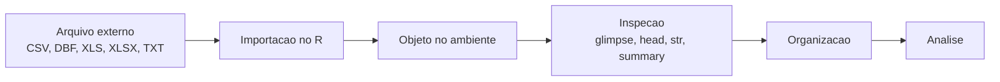
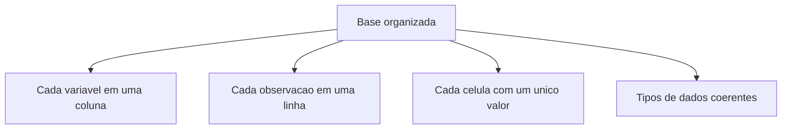

# Curso de Introducao a Linguagem R

## Modulo 2 - Importar e organizar bases de dados na linguagem R

**Publico-alvo:** estudantes e profissionais que ja tiveram o primeiro contato com R e agora precisam trazer dados reais para dentro do ambiente de analise.

**Proposta do modulo:** desenvolver a habilidade fundamental de importar bases de dados, reconhecer a estrutura de dados tabulares, compreender tipos de variaveis e preparar os dados para as primeiras analises em Vigilancia em Saude.

> Material de referencia usado nesta versao: texto-base do Modulo 2, ebook "Modulo 02: Importar e organizar bases de dados na linguagem R", PDFs suplementares "Introducao a analise de dados com o R" e "Importando o banco de dados com o R", alem das bases `MPOX_CSV2_EXEMPLO.csv`, `NINDINET_EXEMPLO.dbf` e `sinannet_heparj_bysexo.xls`.

---

## 1. Boas-vindas

Ola! Seja bem-vindo(a) ao segundo modulo do curso de **Introducao ao Software R aplicado a Vigilancia em Saude**.

Neste modulo voce ira aprender a:

- conceituar a estrutura basica de um banco de dados;
- reconhecer dados tabulares;
- importar arquivos em diferentes formatos;
- trabalhar com arquivos `.csv`, `.dbf`, `.xls` e `.xlsx`;
- usar funcoes de importacao no R;
- conhecer diferentes tipos de variaveis;
- inspecionar uma base importada;
- identificar erros e avisos comuns durante a importacao.

Neste modulo, estaremos imersos no mundo da **importacao e organizacao de dados**. A meta e que a turma consiga trazer dados estruturados para dentro do R e deixar esses dados prontos para as proximas etapas de analise.

Imagine ter a sua disposicao bases armazenadas em diferentes formatos, como DBF, CSV e planilhas do Excel. Agora imagine conseguir importar esses arquivos, verificar se as colunas vieram corretamente, identificar datas, textos e numeros, e iniciar uma analise com mais seguranca. E esse o caminho deste modulo.

---

## 2. Por que importar dados e uma habilidade central?

No modulo 1, trabalhamos com comandos, objetos e calculos simples. Agora vamos buscar a materia-prima da analise: **os dados**.

Em Vigilancia em Saude, os dados podem vir de muitas fontes:

- sistemas oficiais do Ministerio da Saude;
- sistemas municipais ou estaduais;
- planilhas de acompanhamento;
- arquivos exportados de sistemas de notificacao;
- bases abertas;
- bancos historicos em formatos antigos, como DBF;
- arquivos recebidos por e-mail ou compartilhados em pastas.

Na maioria das vezes, esses dados chegam em formato tabular, semelhante a uma planilha: linhas e colunas.



Aprender a importar bem evita problemas nas etapas seguintes. Uma data importada como texto, um identificador convertido para numero ou uma coluna separada pelo delimitador errado podem comprometer toda a analise.

---

## 3. Objetivos do Modulo

O objetivo do Modulo 2 esta centrado no desenvolvimento da habilidade de importar e organizar bases de dados na linguagem R.

Ao final deste modulo, os participantes estarao aptos a:

1. **Importar diferentes tipos de bases de dados**
   - arquivos `.csv`;
   - arquivos `.dbf`;
   - arquivos `.xls` e `.xlsx`;
   - arquivos simples usando `scan()`.

2. **Organizar e manipular dados de forma inicial**
   - criar objetos que guardam bases completas;
   - visualizar primeiras linhas;
   - inspecionar nomes de colunas;
   - verificar tipos de variaveis;
   - compreender a diferenca entre dado importado e dado corretamente interpretado.

3. **Reconhecer desafios comuns**
   - caminho de arquivo incorreto;
   - barras invertidas no Windows;
   - delimitador errado;
   - codificacao de caracteres;
   - datas importadas como texto;
   - identificadores importados como numeros;
   - variaveis categoricas representadas por codigos.

Essas habilidades sao essenciais para qualquer analise de dados e formam a base para os modulos seguintes.

---

## 4. Conteudo Programatico

**Modulo 2: Importacao de bases de dados com a linguagem R**

- Introducao a analise de dados com R
- Estrutura basica de um banco de dados
- Dados tabulares: linhas, colunas e celulas
- Dados organizados e tipos de variaveis
- Caminhos de arquivos no Windows
- Diretorio de trabalho
- Projetos no RStudio
- Importacao de arquivos `.csv`
- Importacao de arquivos `.dbf`
- Importacao de arquivos `.xls` e `.xlsx`
- Importacao com `scan()`
- Inspecao inicial com `View()`, `head()`, `summary()`, `str()` e `dplyr::glimpse()`
- Erros e avisos comuns sobre importacao de dados
- Atividades praticas com bases de exemplo

---

## 5. Introducao a analise de dados em saude

A analise de dados em saude e uma das tarefas mais relevantes dos servicos de Vigilancia em Saude. O conhecimento das condicoes de saude de uma populacao ou de um territorio ajuda a:

- priorizar recursos;
- orientar acoes de prevencao;
- monitorar agravos;
- avaliar tendencias;
- planejar politicas publicas;
- comunicar riscos;
- apoiar decisoes tecnicas e de gestao.

Neste curso, trabalharemos principalmente com **dados estruturados**, isto e, dados organizados em tabelas.

O R tambem consegue lidar com textos, imagens, mapas e dados nao estruturados. Mas, no nivel inicial desta formacao, o foco sera em tabelas: bases com linhas e colunas.

---

## 6. Estrutura basica de um banco de dados

Um banco de dados tabular tem uma estrutura parecida com esta:

| Linha | NU_NOTIFIC | DT_NOTIFIC | CS_SEXO | NU_IDADE_N | CLASSI_FIN |
|---:|---|---|---|---:|---|
| 1 | 912900010553 | 23/02/2024 | 1 | 33 | 1 |
| 2 | 912900010979 | 18/02/2024 | 1 | 22 |  |
| 3 | 912900010960 | 20/02/2024 | 2 | 57 |  |

Cada parte da tabela tem um significado:

| Elemento | Significado |
|---|---|
| Linha | Uma observacao, registro, notificacao, pessoa, evento ou unidade analisada |
| Coluna | Uma variavel |
| Celula | O valor de uma variavel para uma observacao |
| Nome da coluna | Identificador da variavel |
| Base de dados | Conjunto completo de linhas e colunas |

### 6.1 Exemplo em Vigilancia em Saude

Em uma base de notificacoes:

- cada linha pode representar uma notificacao;
- `NU_NOTIFIC` pode ser o identificador da notificacao;
- `DT_NOTIFIC` pode ser a data de notificacao;
- `CS_SEXO` pode representar o sexo;
- `NU_IDADE_N` pode representar idade;
- `CLASSI_FIN` pode representar classificacao final.

---

## 7. Dados organizados

Uma regra muito usada em ciencia de dados e a ideia de **dados organizados** ou **tidy data**.

Em uma tabela bem organizada:

- cada variavel fica em uma coluna;
- cada observacao fica em uma linha;
- cada celula contem um unico valor;
- os nomes das colunas sao claros;
- os tipos de variaveis estao coerentes.



### 7.1 Quando uma base nao esta bem organizada?

Alguns sinais de alerta:

- uma coluna guarda varios valores misturados;
- datas aparecem como texto em formatos diferentes;
- codigos numericos sao interpretados como numeros quando deveriam ser texto;
- nomes de colunas tem espacos, acentos ou caracteres especiais;
- ha linhas de titulo antes da tabela real;
- ha totais no final da planilha misturados com dados;
- uma mesma variavel aparece dividida em varias colunas sem necessidade.

---

## 8. Tipos de variaveis

Depois de importar uma base, precisamos verificar como o R interpretou cada coluna.

| Tipo no R | O que representa | Exemplos |
|---|---|---|
| `character` | Texto | `"MONKEYPOX"`, `"ENCERRADA"`, `"912900010553"` |
| `numeric` | Numero real | `33`, `57.5`, `10.2` |
| `integer` | Numero inteiro | `1`, `2`, `2024` |
| `logical` | Verdadeiro ou falso | `TRUE`, `FALSE` |
| `Date` | Data | `2024-02-23` |
| `factor` | Categoria | sexo, classificacao, municipio |

### 8.1 Cuidado com identificadores

Nem tudo que parece numero deve ser importado como numero.

Exemplo:

```r
NU_NOTIFIC <- "912900010553"
```

O identificador de notificacao nao deve ser usado para contas matematicas. Por isso, muitas vezes e melhor importa-lo como texto.

Se um identificador tiver zeros a esquerda, importar como numero pode apagar esses zeros.

### 8.2 Cuidado com datas

Datas podem chegar assim:

```text
23/02/2024
```

Mas o R pode importar como texto se nao souber o formato. No `readr`, podemos declarar:

```r
col_date(format = "%d/%m/%Y")
```

Isso diz ao R que a data esta no formato dia/mes/ano.

---

## 9. Caminhos de arquivos no Windows

Um dos erros mais comuns no inicio e o caminho do arquivo.

No Windows, o caminho costuma aparecer assim:

```text
F:\PROJETO_CURSO_R\Modulo 2\DADOS
```

Mas, dentro do R, a barra invertida `\` tem significado especial. Por isso, podemos escrever o caminho de duas formas.

### 9.1 Duplicando as barras

```r
"F:\\PROJETO_CURSO_R\\Modulo 2\\DADOS\\MPOX_CSV2_EXEMPLO.csv"
```

### 9.2 Invertendo as barras

```r
"F:/PROJETO_CURSO_R/Modulo 2/DADOS/MPOX_CSV2_EXEMPLO.csv"
```

As duas formas funcionam. Para aulas, a segunda costuma ser mais facil de ler.

---

## 10. Diretorio de trabalho e projetos

O diretorio de trabalho e a pasta que o R considera como ponto de partida.

Para ver o diretorio atual:

```r
getwd()
```

Para definir um diretorio:

```r
setwd("F:/PROJETO_CURSO_R/Modulo 2")
```

Depois disso, se o arquivo estiver dentro da pasta `DADOS`, podemos importar com caminho relativo:

```r
MPOX <- readr::read_delim("DADOS/MPOX_CSV2_EXEMPLO.csv", delim = ";")
```

### 10.1 Caminho absoluto x caminho relativo

| Tipo de caminho | Exemplo | Vantagem | Risco |
|---|---|---|---|
| Absoluto | `"F:/PROJETO_CURSO_R/Modulo 2/DADOS/base.csv"` | Aponta exatamente para o arquivo | Pode nao funcionar em outro computador |
| Relativo | `"DADOS/base.csv"` | Melhor para compartilhar projetos | Depende do diretorio de trabalho correto |

### 10.2 Melhor pratica

Para trabalhos compartilhados, a melhor pratica e usar **Projects** do RStudio.

Uma estrutura recomendada:

```text
PROJETO_CURSO_R/
  Modulo 2/
    scripts/
      01_importacao_csv.R
      02_importacao_dbf.R
      03_importacao_excel.R
    DADOS/
      MPOX_CSV2_EXEMPLO.csv
      NINDINET_EXEMPLO.dbf
      sinannet_heparj_bysexo.xls
    resultados/
```

---

## 11. Pacotes usados neste modulo

Antes de importar, precisamos instalar alguns pacotes.

```r
install.packages("readr")
install.packages("readxl")
install.packages("foreign")
install.packages("dplyr")
install.packages("rio")
```

Depois, carregamos os pacotes:

```r
library(readr)
library(readxl)
library(foreign)
library(dplyr)
library(rio)
```

| Pacote | Para que serve neste modulo |
|---|---|
| `readr` | Importar CSV e arquivos delimitados |
| `readxl` | Importar arquivos Excel `.xls` e `.xlsx` |
| `foreign` | Importar arquivos DBF com `read.dbf()` |
| `dplyr` | Inspecionar e manipular dados, com `glimpse()` |
| `rio` | Importar diferentes formatos com uma funcao geral, `import()` |

---

## 12. Importando arquivos CSV

CSV significa **Comma-Separated Values**, ou valores separados por virgula. Na pratica, muitos arquivos chamados CSV podem usar outros separadores, como ponto e virgula.

O arquivo `MPOX_CSV2_EXEMPLO.csv` enviado para este modulo usa `;` como delimitador.

Ele contem:

- 359 linhas;
- 13 colunas;
- colunas como `NU_NOTIFIC`, `STATUS`, `DT_NOTIFIC`, `DT_NASC`, `NU_IDADE_N`, `CS_SEXO`, `NO_AGRAVO` e `CLASSI_FIN`.

### 12.1 Exemplo de estrutura do CSV

```text
NU_NOTIFIC;STATUS;CO_UF_NOT;DT_NOTIFIC;DT_NASC;NU_IDADE_N;CS_SEXO;NO_AGRAVO;ID_AGRAVO;SINTOMA;DT_COLETA;OPORTUNIDADE_ENCERRAMENTO;CLASSI_FIN
912900010553;ENCERRADA;91;23/02/2024;18/03/1990;33;1;MONKEYPOX;B04;10040882, 10016558;21/02/2024;Oportuno;1
```

### 12.2 Importacao com `read_csv()`

Use `read_csv()` quando o arquivo estiver separado por virgulas.

```r
library(readr)

MPOX_CSV <- read_csv("F:/PROJETO_CURSO_R/Modulo 2/DADOS/MPOX_CSV_EXEMPLO.csv")

View(MPOX_CSV)
```

### 12.3 Importacao com `read_delim()`

Use `read_delim()` quando voce precisa informar o delimitador.

```r
library(readr)

MPOX_CSV2_EXEMPLO <- read_delim(
  "F:/PROJETO_CURSO_R/Modulo 2/DADOS/MPOX_CSV2_EXEMPLO.csv",
  delim = ";",
  escape_double = FALSE,
  col_types = cols(
    NU_NOTIFIC = col_character(),
    DT_NOTIFIC = col_date(format = "%d/%m/%Y")
  ),
  trim_ws = TRUE
)

View(MPOX_CSV2_EXEMPLO)
```

### 12.4 Explicando o codigo

| Trecho | Explicacao |
|---|---|
| `read_delim()` | Le arquivo delimitado |
| `delim = ";"` | Informa que as colunas sao separadas por ponto e virgula |
| `escape_double = FALSE` | Controla tratamento de aspas duplicadas |
| `col_types = cols(...)` | Define tipos de colunas manualmente |
| `NU_NOTIFIC = col_character()` | Importa identificador como texto |
| `DT_NOTIFIC = col_date(format = "%d/%m/%Y")` | Importa data no formato dia/mes/ano |
| `trim_ws = TRUE` | Remove espacos antes e depois dos valores |

### 12.5 Inspecao depois da importacao

```r
dplyr::glimpse(MPOX_CSV2_EXEMPLO)
head(MPOX_CSV2_EXEMPLO)
summary(MPOX_CSV2_EXEMPLO)
str(MPOX_CSV2_EXEMPLO)
```

---

## 13. Importacao CSV usando o pacote rio

O pacote `rio` e uma alternativa pratica para importar varios formatos com uma unica funcao: `import()`.

```r
library(rio)

MPOX <- import("F:/PROJETO_CURSO_R/Modulo 2/DADOS/MPOX_CSV2_EXEMPLO.csv")
```

Depois de definir o diretorio de trabalho:

```r
setwd("F:/PROJETO_CURSO_R/Modulo 2")

MPOX <- import("DADOS/MPOX_CSV2_EXEMPLO.csv")
```

Inspecione:

```r
dplyr::glimpse(MPOX)
```

### 13.1 Quando usar `rio::import()`?

Use `rio::import()` quando voce quer uma importacao rapida e o arquivo esta bem comportado.

Use funcoes mais especificas, como `readr::read_delim()` ou `readxl::read_excel()`, quando voce precisa controlar delimitador, encoding, tipo de coluna, aba ou intervalo.

---

## 14. Importando arquivos DBF

DBF significa **Database File**. E um formato historico associado ao dBASE e muito encontrado em bases antigas ou exportacoes de sistemas.

Em saude publica, arquivos `.dbf` aparecem com frequencia em bases do SINAN e outros sistemas.

O arquivo de exemplo `NINDINET_EXEMPLO.dbf` contem:

- 1000 registros;
- campos como `NU_NOTIFIC`, `TP_NOT`, `ID_AGRAVO`, `DT_NOTIFIC`, `NU_ANO`, `ID_MUNICIP`, `NU_IDADE_N` e `CS_SEXO`.

### 14.1 Importacao com `foreign::read.dbf()`

```r
library(foreign)
library(dplyr)

setwd("F:/PROJETO_CURSO_R/Modulo 2")

NINDINET <- read.dbf(
  "DADOS/NINDINET_EXEMPLO.dbf",
  as.is = TRUE
)

glimpse(NINDINET)
```

### 14.2 O que significa `as.is = TRUE`?

O argumento `as.is = TRUE` evita que variaveis de texto sejam automaticamente convertidas para fatores.

Isso costuma facilitar o inicio da analise, especialmente para quem ainda esta aprendendo.

```r
NINDINET <- read.dbf("DADOS/NINDINET_EXEMPLO.dbf", as.is = TRUE)
```

### 14.3 Atencao com DBF

Arquivos DBF podem apresentar desafios:

- nomes de colunas limitados;
- codificacao antiga de caracteres;
- datas importadas como texto;
- numeros com muitas casas decimais;
- identificadores que parecem numeros;
- campos vazios;
- formatos diferentes dependendo da origem.

Depois de importar, sempre rode:

```r
glimpse(NINDINET)
head(NINDINET)
summary(NINDINET)
```

---

## 15. Importando arquivos Excel

Planilhas Excel podem aparecer em dois formatos principais:

- `.xls`: formato mais antigo;
- `.xlsx`: formato mais recente.

O pacote mais usado para importar esse tipo de arquivo e o `readxl`.

### 15.1 Instalando e carregando

```r
install.packages("readxl")
library(readxl)
```

### 15.2 Importando XLS

```r
library(readxl)

heparj_bysexo <- read_excel("Desktop/sinannet_heparj_bysexo.xls")

View(heparj_bysexo)
```

### 15.3 Importando XLSX

```r
library(readxl)

sinannet_heparj_bysexo1 <- read_excel("Desktop/sinannet_heparj_bysexo1.xlsx")

View(sinannet_heparj_bysexo1)
```

### 15.4 Usando diretorio de trabalho

```r
setwd("Desktop")

heparj_bysexo <- read_excel("sinannet_heparj_bysexo.xls")

heparj_bysexo
```

### 15.5 Escolhendo o arquivo com janela

```r
meu_dado <- read_excel(file.choose())
```

Esse comando abre uma janela para selecionar o arquivo. E util em aula, mas em analises reprodutiveis prefira escrever o caminho do arquivo no script.

### 15.6 Inspecionando a planilha

```r
dplyr::glimpse(sinannet_heparj_bysexo1)
head(sinannet_heparj_bysexo1)
summary(sinannet_heparj_bysexo1)
str(sinannet_heparj_bysexo1)
```

### 15.7 Argumentos uteis do `read_excel()`

```r
read_excel(
  path = "DADOS/sinannet_heparj_bysexo.xls",
  sheet = 1,
  col_names = TRUE,
  skip = 0
)
```

| Argumento | Para que serve |
|---|---|
| `path` | Caminho do arquivo |
| `sheet` | Aba a ser importada |
| `range` | Intervalo especifico de celulas |
| `col_names` | Indica se a primeira linha tem nomes das colunas |
| `skip` | Pula linhas antes de importar |
| `n_max` | Limita o numero de linhas importadas |
| `col_types` | Define tipos das colunas |

---

## 16. Importacao usando `scan()`

A funcao `scan()` le dados digitados manualmente ou dados em arquivos de texto simples.

Ela e menos usada para bases tabulares modernas, mas e muito boa para entender como o R le entradas.

### 16.1 Lendo numeros digitados pelo usuario

```r
dados <- scan(what = numeric(), n = 5)
```

Depois de executar, o console fica aguardando os valores.

Digite:

```text
4 5 6 7 8
```

Depois pressione Enter.

Para exibir:

```r
print(dados)
```

### 16.2 Lendo arquivo de texto com `scan()`

Imagine um arquivo chamado `exemplo_scan.txt` com o seguinte conteudo:

```text
1 Joao 35 175 80
2 Maria 28 160 65
3 Jose 45 180 90
```

Cada coluna representa:

| Posicao | Variavel |
|---:|---|
| 1 | ID do paciente |
| 2 | Nome |
| 3 | Idade |
| 4 | Altura em centimetros |
| 5 | Peso em quilogramas |

Codigo:

```r
caminho_arquivo <- "Desktop/exemplo_scan.txt"

dados <- scan(
  caminho_arquivo,
  what = list(0, "", 0, 0, 0),
  na.strings = ""
)

print(dados)
```

### 16.3 Explicando `what = list(0, "", 0, 0, 0)`

Esse argumento informa o tipo esperado em cada coluna:

- `0`: numero;
- `""`: texto;
- `0`: numero;
- `0`: numero;
- `0`: numero.

---

## 17. Funcoes para inspecionar dados

Importar nao basta. Depois de importar, precisamos olhar a base.

| Funcao | O que faz |
|---|---|
| `View(dados)` | Abre a base em uma visualizacao tipo planilha no RStudio |
| `head(dados)` | Mostra as primeiras linhas |
| `tail(dados)` | Mostra as ultimas linhas |
| `names(dados)` | Mostra nomes das colunas |
| `dim(dados)` | Mostra numero de linhas e colunas |
| `nrow(dados)` | Mostra numero de linhas |
| `ncol(dados)` | Mostra numero de colunas |
| `str(dados)` | Mostra estrutura e tipos |
| `summary(dados)` | Mostra resumo das variaveis |
| `dplyr::glimpse(dados)` | Mostra estrutura de forma compacta |

Exemplo:

```r
dim(MPOX_CSV2_EXEMPLO)
names(MPOX_CSV2_EXEMPLO)
head(MPOX_CSV2_EXEMPLO)
dplyr::glimpse(MPOX_CSV2_EXEMPLO)
```

---

## 18. Scripts revisados do modulo

### 18.1 Script: importacao CSV

```r
####################################################################
## Curso - Introducao ao Software R aplicado a Vigilancia em Saude
## Modulo 2 - Importando arquivos no formato CSV
####################################################################

# Carregando pacotes
library(readr)
library(dplyr)

# Exemplo com arquivo separado por ponto e virgula
MPOX_CSV2_EXEMPLO <- read_delim(
  "F:/PROJETO_CURSO_R/Modulo 2/DADOS/MPOX_CSV2_EXEMPLO.csv",
  delim = ";",
  escape_double = FALSE,
  col_types = cols(
    NU_NOTIFIC = col_character(),
    DT_NOTIFIC = col_date(format = "%d/%m/%Y")
  ),
  trim_ws = TRUE
)

# Visualizando e inspecionando
View(MPOX_CSV2_EXEMPLO)
glimpse(MPOX_CSV2_EXEMPLO)
head(MPOX_CSV2_EXEMPLO)
summary(MPOX_CSV2_EXEMPLO)
```

### 18.2 Script: importacao CSV com rio

```r
####################################################################
## Curso - Introducao ao Software R aplicado a Vigilancia em Saude
## Modulo 2 - Importando arquivos com rio
####################################################################

library(rio)
library(dplyr)

setwd("F:/PROJETO_CURSO_R/Modulo 2")

MPOX <- import("DADOS/MPOX_CSV2_EXEMPLO.csv")

glimpse(MPOX)
head(MPOX)
```

### 18.3 Script: importacao DBF

```r
####################################################################
## Curso - Introducao ao Software R aplicado a Vigilancia em Saude
## Modulo 2 - Importando arquivos no formato DBF
####################################################################

library(foreign)
library(dplyr)

setwd("F:/PROJETO_CURSO_R/Modulo 2")

NINDINET <- read.dbf(
  "DADOS/NINDINET_EXEMPLO.dbf",
  as.is = TRUE
)

glimpse(NINDINET)
head(NINDINET)
summary(NINDINET)
```

### 18.4 Script: importacao Excel

```r
####################################################################
## Curso - Introducao ao Software R aplicado a Vigilancia em Saude
## Modulo 2 - Importando arquivos XLS e XLSX
####################################################################

library(readxl)
library(dplyr)

# XLS
heparj_bysexo <- read_excel("Desktop/sinannet_heparj_bysexo.xls")
View(heparj_bysexo)

# XLSX
sinannet_heparj_bysexo1 <- read_excel("Desktop/sinannet_heparj_bysexo1.xlsx")
View(sinannet_heparj_bysexo1)

# Usando diretorio de trabalho
setwd("Desktop")

heparj_bysexo <- read_excel("sinannet_heparj_bysexo.xls")

glimpse(heparj_bysexo)
head(heparj_bysexo)
summary(heparj_bysexo)
str(heparj_bysexo)

# Selecionando arquivo manualmente
meu_dado <- read_excel(file.choose())
```

### 18.5 Script: scan

```r
####################################################################
## Curso - Introducao ao Software R aplicado a Vigilancia em Saude
## Modulo 2 - Importando arquivos usando scan()
####################################################################

# Solicitando ao usuario que insira 5 numeros separados por espacos
dados <- scan(what = numeric(), n = 5)

# Exemplo de entrada:
# 4 5 6 7 8

print(dados)

# Lendo arquivo de texto
caminho_arquivo <- "Desktop/exemplo_scan.txt"

dados_pacientes <- scan(
  caminho_arquivo,
  what = list(0, "", 0, 0, 0),
  na.strings = ""
)

print(dados_pacientes)
```

---

## 19. Erros e avisos comuns

### 19.1 Arquivo nao encontrado

Mensagem comum:

```text
cannot open file 'DADOS/base.csv': No such file or directory
```

Possiveis causas:

- o arquivo nao esta na pasta indicada;
- o nome esta escrito diferente;
- a extensao esta errada;
- o diretorio de trabalho nao foi definido corretamente.

Como investigar:

```r
getwd()
list.files()
list.files("DADOS")
```

### 19.2 Barras do Windows

Incorreto:

```r
read_csv("F:\PROJETO_CURSO_R\Modulo 2\DADOS\base.csv")
```

Correto:

```r
read_csv("F:/PROJETO_CURSO_R/Modulo 2/DADOS/base.csv")
```

Ou:

```r
read_csv("F:\\PROJETO_CURSO_R\\Modulo 2\\DADOS\\base.csv")
```

### 19.3 Delimitador errado

Se um CSV separado por `;` for lido como se fosse separado por `,`, a base pode aparecer inteira em uma unica coluna.

Solucao:

```r
read_delim("DADOS/MPOX_CSV2_EXEMPLO.csv", delim = ";")
```

### 19.4 Data importada como texto

Se `DT_NOTIFIC` vier como `character`, declare o formato:

```r
read_delim(
  "DADOS/MPOX_CSV2_EXEMPLO.csv",
  delim = ";",
  col_types = cols(
    DT_NOTIFIC = col_date(format = "%d/%m/%Y")
  )
)
```

### 19.5 Identificador importado como numero

Se `NU_NOTIFIC` vier como numero, pode haver risco de perder zeros a esquerda ou alterar a exibicao.

Declare como texto:

```r
col_types = cols(
  NU_NOTIFIC = col_character()
)
```

### 19.6 Pacote nao instalado

Mensagem comum:

```text
there is no package called 'readxl'
```

Solucao:

```r
install.packages("readxl")
library(readxl)
```

### 19.7 Funcao nao encontrada

Mensagem comum:

```text
could not find function "read_excel"
```

Possivel causa: o pacote nao foi carregado.

Solucao:

```r
library(readxl)
```

Ou use o nome completo:

```r
readxl::read_excel("arquivo.xlsx")
```

---

## 20. Roteiro de aula sugerido

### Aula 1 - Dados tabulares e caminhos

Tempo sugerido: 60 minutos.

1. Apresentar os objetivos do modulo.
2. Discutir fontes de dados em Vigilancia em Saude.
3. Explicar linhas, colunas, celulas e variaveis.
4. Mostrar dados organizados.
5. Explicar caminhos absolutos, relativos e barras no Windows.
6. Criar a estrutura de pastas do modulo.

### Aula 2 - Importacao CSV

Tempo sugerido: 60 a 90 minutos.

1. Abrir o CSV em editor de texto para ver o delimitador.
2. Importar com `read_csv()` e discutir quando funciona.
3. Importar com `read_delim(delim = ";")`.
4. Declarar `NU_NOTIFIC` como texto.
5. Declarar `DT_NOTIFIC` como data.
6. Rodar `glimpse()`, `head()`, `summary()` e `str()`.

### Aula 3 - Importacao DBF e Excel

Tempo sugerido: 60 a 90 minutos.

1. Explicar o que e DBF e por que aparece em bases de saude.
2. Importar `NINDINET_EXEMPLO.dbf`.
3. Inspecionar tipos.
4. Importar `sinannet_heparj_bysexo.xls`.
5. Explicar diferenca entre `.xls` e `.xlsx`.
6. Usar `file.choose()` apenas como demonstracao.

### Aula 4 - Scan, erros e pratica guiada

Tempo sugerido: 60 minutos.

1. Demonstrar `scan()` com numeros digitados.
2. Criar arquivo `exemplo_scan.txt`.
3. Importar com `scan()`.
4. Provocar erros intencionais.
5. Pedir que a turma corrija caminhos, delimitadores e pacotes ausentes.

---

## 21. Atividades praticas

### Atividade 1 - Conferindo o ambiente

No RStudio, execute:

```r
getwd()
list.files()
```

Perguntas:

- Qual e o diretorio de trabalho atual?
- A pasta `DADOS` aparece?
- O arquivo `MPOX_CSV2_EXEMPLO.csv` esta dentro dela?

### Atividade 2 - Importando CSV

Importe o arquivo `MPOX_CSV2_EXEMPLO.csv` usando `read_delim()`.

Depois responda:

- Quantas linhas a base tem?
- Quantas colunas?
- Quais sao os nomes das colunas?
- Qual e o tipo de `DT_NOTIFIC`?
- Qual e o tipo de `NU_NOTIFIC`?

Comandos uteis:

```r
dim(MPOX_CSV2_EXEMPLO)
names(MPOX_CSV2_EXEMPLO)
dplyr::glimpse(MPOX_CSV2_EXEMPLO)
```

### Atividade 3 - Importando DBF

Importe o arquivo `NINDINET_EXEMPLO.dbf`.

Depois responda:

- Quais sao as primeiras colunas?
- A variavel `CS_SEXO` aparece na base?
- A variavel `DT_NOTIFIC` foi importada como texto ou data?
- O que voce precisaria fazer para transformar uma data em formato de data?

### Atividade 4 - Importando Excel

Importe `sinannet_heparj_bysexo.xls`.

Depois execute:

```r
head(heparj_bysexo)
summary(heparj_bysexo)
str(heparj_bysexo)
```

Perguntas:

- A primeira linha virou nome de coluna corretamente?
- Ha linhas extras no inicio ou no fim?
- Alguma coluna deveria ser texto, mas veio como numero?

### Atividade 5 - Corrigindo erros

Corrija os codigos abaixo:

```r
read_csv("F:\PROJETO_CURSO_R\Modulo 2\DADOS\MPOX_CSV2_EXEMPLO.csv")
```

```r
MPOX <- read_csv("DADOS/MPOX_CSV2_EXEMPLO.csv")
```

```r
read_excel("sinannet_heparj_bysexo.xls")
```

```r
glimpse(MPOX)
```

Dica: alguns erros dependem de pacote carregado, delimitador correto ou diretorio de trabalho.

---

## 22. Checklist do estudante

Ao final deste modulo, verifique se voce consegue:

- explicar o que e uma base tabular;
- diferenciar linha, coluna, celula e variavel;
- reconhecer dados organizados;
- identificar o formato de um arquivo;
- escrever caminhos de arquivo no R;
- diferenciar caminho absoluto e relativo;
- usar `getwd()` e `setwd()`;
- importar CSV com `readr`;
- importar CSV separado por `;`;
- importar DBF com `foreign`;
- importar Excel com `readxl`;
- usar `rio::import()`;
- usar `scan()` em um exemplo simples;
- inspecionar dados com `head()`, `str()`, `summary()` e `glimpse()`;
- reconhecer erros comuns de importacao.

---

## 23. Sugestoes de melhoria para o curso

1. **Criar uma pasta padrao por modulo**
   - Isso ajuda os estudantes a entenderem caminhos relativos desde cedo.

2. **Entregar um script limpo junto com cada aula**
   - Um script de demonstracao e um script de exercicio.

3. **Mostrar o CSV em editor de texto antes de importar**
   - Isso ajuda a turma a enxergar o delimitador.

4. **Usar um quadro de decisao**
   - Se o arquivo e CSV, use `readr`.
   - Se e Excel, use `readxl`.
   - Se e DBF, use `foreign`.
   - Se quer importar rapido varios formatos, teste `rio`.

5. **Introduzir validacao logo apos importar**
   - Conferir linhas, colunas, tipos e primeiras observacoes antes de analisar.

6. **Evitar `setwd()` em projetos mais avancados**
   - No inicio ele e didatico, mas nos proximos modulos vale migrar para RStudio Projects e caminhos relativos.

---

## 24. Script final do modulo

Este script pode ser entregue aos estudantes como arquivo `.R`.

```r
############################################################
# Curso de Introducao ao R aplicado a Vigilancia em Saude
# Modulo 2 - Importacao e organizacao de bases de dados
############################################################

# 1. Pacotes ---------------------------------------------------------------

install.packages("readr")
install.packages("readxl")
install.packages("foreign")
install.packages("dplyr")
install.packages("rio")

library(readr)
library(readxl)
library(foreign)
library(dplyr)
library(rio)

# 2. Diretorio de trabalho ------------------------------------------------

getwd()

# Ajuste este caminho para o seu computador
setwd("F:/PROJETO_CURSO_R/Modulo 2")

list.files()
list.files("DADOS")

# 3. Importacao CSV -------------------------------------------------------

MPOX_CSV2_EXEMPLO <- read_delim(
  "DADOS/MPOX_CSV2_EXEMPLO.csv",
  delim = ";",
  escape_double = FALSE,
  col_types = cols(
    NU_NOTIFIC = col_character(),
    DT_NOTIFIC = col_date(format = "%d/%m/%Y")
  ),
  trim_ws = TRUE
)

View(MPOX_CSV2_EXEMPLO)
glimpse(MPOX_CSV2_EXEMPLO)
head(MPOX_CSV2_EXEMPLO)
summary(MPOX_CSV2_EXEMPLO)
str(MPOX_CSV2_EXEMPLO)

# 4. Importacao CSV com rio ----------------------------------------------

MPOX <- import("DADOS/MPOX_CSV2_EXEMPLO.csv")

glimpse(MPOX)

# 5. Importacao DBF -------------------------------------------------------

NINDINET <- read.dbf(
  "DADOS/NINDINET_EXEMPLO.dbf",
  as.is = TRUE
)

glimpse(NINDINET)
head(NINDINET)
summary(NINDINET)

# 6. Importacao Excel -----------------------------------------------------

heparj_bysexo <- read_excel("DADOS/sinannet_heparj_bysexo.xls")

View(heparj_bysexo)
glimpse(heparj_bysexo)
head(heparj_bysexo)
summary(heparj_bysexo)
str(heparj_bysexo)

# 7. Importacao com scan --------------------------------------------------

dados <- scan(what = numeric(), n = 5)
# Digite no console: 4 5 6 7 8

print(dados)

# Exemplo com arquivo de texto
caminho_arquivo <- "DADOS/exemplo_scan.txt"

dados_pacientes <- scan(
  caminho_arquivo,
  what = list(0, "", 0, 0, 0),
  na.strings = ""
)

print(dados_pacientes)

# 8. Inspecoes uteis ------------------------------------------------------

dim(MPOX_CSV2_EXEMPLO)
names(MPOX_CSV2_EXEMPLO)
nrow(MPOX_CSV2_EXEMPLO)
ncol(MPOX_CSV2_EXEMPLO)
```

---

## 25. Glossario do Modulo 2

| Termo | Significado |
|---|---|
| Banco de dados | Conjunto organizado de informacoes |
| Dados tabulares | Dados organizados em linhas e colunas |
| Linha | Uma observacao ou registro |
| Coluna | Uma variavel |
| Celula | Valor de uma variavel em uma observacao |
| Variavel | Caracteristica observada, como idade, sexo ou data |
| CSV | Arquivo de texto com valores separados por delimitador |
| Delimitador | Caractere que separa colunas, como `,` ou `;` |
| DBF | Formato de banco de dados usado em sistemas antigos |
| XLS | Formato antigo de planilha Excel |
| XLSX | Formato atual de planilha Excel |
| Caminho absoluto | Caminho completo ate o arquivo |
| Caminho relativo | Caminho a partir do diretorio de trabalho |
| Diretorio de trabalho | Pasta atual usada pelo R |
| Importacao | Processo de trazer dados para o R |
| `glimpse()` | Funcao para visualizar estrutura da base |
| `head()` | Funcao para ver primeiras linhas |
| `str()` | Funcao para ver estrutura do objeto |
| `summary()` | Funcao para resumir variaveis |

---

## 26. Referencias e links

- CRAN - The Comprehensive R Archive Network: [https://cran.r-project.org/](https://cran.r-project.org/)
- Manual oficial "An Introduction to R": [https://cran.r-project.org/doc/manuals/r-release/R-intro.html](https://cran.r-project.org/doc/manuals/r-release/R-intro.html)
- Documentacao do `readr`: [https://readr.tidyverse.org/reference/read_delim.html](https://readr.tidyverse.org/reference/read_delim.html)
- Documentacao do `readxl`: [https://readxl.tidyverse.org/reference/read_excel.html](https://readxl.tidyverse.org/reference/read_excel.html)
- Documentacao do `foreign::read.dbf()`: [https://stat.ethz.ch/R-manual/R-devel/library/foreign/html/read.dbf.html](https://stat.ethz.ch/R-manual/R-devel/library/foreign/html/read.dbf.html)
- Pacote `rio` no CRAN: [https://cran.r-project.org/web/packages/rio/index.html](https://cran.r-project.org/web/packages/rio/index.html)
- RStudio IDE User Guide: [https://docs.posit.co/ide/user/](https://docs.posit.co/ide/user/)
- Cheatsheets da Posit: [https://posit.co/resources/cheatsheets/](https://posit.co/resources/cheatsheets/)
- R for Data Science: [https://r4ds.hadley.nz/](https://r4ds.hadley.nz/)
- The Epidemiologist R Handbook: [https://epirhandbook.com/](https://epirhandbook.com/)

