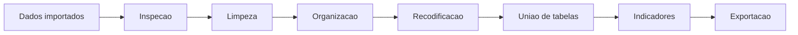
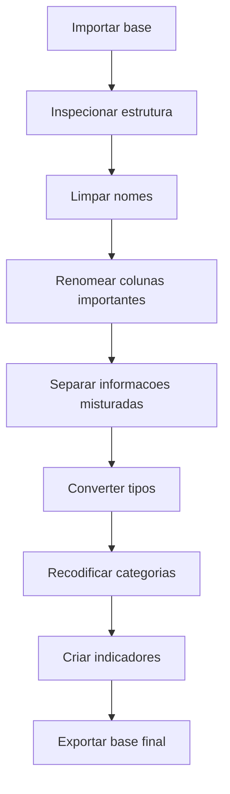

# Curso de Introducao a Linguagem R

## Modulo 3 - Manipulacao de bases de dados com a linguagem R

**Publico-alvo:** estudantes e profissionais que ja sabem criar objetos, importar bases e agora precisam preparar, transformar, unir e exportar dados para analise.

**Proposta do modulo:** ensinar a manipular bases de dados dentro do R, com foco em limpeza, organizacao, recodificacao de variaveis, tratamento de inconsistencias, uniao de tabelas e exportacao de bases em formatos abertos e planilhas.

> Material de referencia usado nesta versao: texto-base do Modulo 3, ebook "Modulo 3: Manipulacao de bases de dados com a linguagem R", PDFs "Preparacao de bases" e "Exportando banco de dados", e scripts suplementares sobre estruturas de dados, criacao de data frame, `dplyr`, transformacao de dengue PR, recodificacao com NINDINET e exportacao.

---

## 1. Boas-vindas

Ola! Seja bem-vindo(a) ao terceiro modulo do curso de **Introducao ao Software R aplicado a Vigilancia em Saude**.

Neste modulo voce ira aprender:

- manipular bases de dados dentro do ambiente R;
- preparar bases para analise;
- limpar e organizar dados;
- identificar valores ausentes, inconsistencias e possiveis outliers;
- recodificar variaveis categoricas e numericas;
- criar novas variaveis;
- transformar bases largas em bases longas;
- unir tabelas com chaves de relacionamento;
- calcular indicadores a partir de bases combinadas;
- exportar bases manipuladas em formatos `.csv`, `.xls` e `.xlsx`;
- reconhecer erros e avisos comuns durante a manipulacao de dados.

Nos modulos anteriores, aprendemos a dar os primeiros comandos e a importar bases de dados. Agora vamos trabalhar no ponto em que muitas analises realmente ganham qualidade: a preparacao dos dados.

---

## 2. Por que preparar bases de dados?

No cotidiano da Vigilancia em Saude, os dados raramente chegam prontos para analise. Eles podem vir com:

- nomes de colunas inconsistentes;
- acentos e caracteres especiais nos nomes das variaveis;
- codigos misturados com descricoes;
- colunas em formato largo;
- datas como texto;
- numeros importados como texto;
- campos vazios;
- valores ignorados;
- totais misturados com linhas de municipios;
- bases separadas que precisam ser combinadas.

Preparar uma base significa transformar os dados brutos em uma estrutura confiavel para analise.



Uma analise so e forte quando a base esta bem compreendida e bem tratada. O R ajuda porque cada etapa fica registrada no script, permitindo revisao, correcao e reproducibilidade.

---

## 3. Objetivos do Modulo

Os objetivos do Modulo 3 sao:

1. **Preparar bases de dados para analise**
   - compreender a importancia da limpeza de dados;
   - identificar valores ausentes;
   - reconhecer inconsistencias;
   - transformar nomes de variaveis;
   - selecionar, filtrar, ordenar e criar colunas.

2. **Recodificar variaveis**
   - transformar codigos em categorias compreensiveis;
   - criar faixas etarias;
   - usar `case_when()`, `if_else()` e `cut()`;
   - ordenar categorias com `factor()`.

3. **Unir tabelas com R**
   - entender chaves de relacionamento;
   - usar `left_join()`;
   - diferenciar tipos de juncoes;
   - combinar bases de casos e populacao.

4. **Exportar dados manipulados**
   - exportar CSV;
   - exportar Excel;
   - criar arquivo `.xlsx` com varias abas;
   - preservar estrutura e integridade dos dados.

5. **Resolver erros comuns**
   - diagnosticar problemas em nomes de colunas;
   - corrigir tipos de variaveis;
   - lidar com `NA`;
   - resolver erro de objeto nao encontrado;
   - identificar problemas de join.

Ao final, os alunos estarao mais preparados para transformar dados importados em bases prontas para analises posteriores.

---

## 4. Conteudo Programatico

**Modulo 3: Manipulacao de bases de dados com a linguagem R**

- Estruturas de dados no R
- Criacao de `data.frame`
- Verbos do pacote `dplyr`
- Operador pipe `|>`
- Preparacao de bases para analise
- Limpeza de nomes com `janitor::clean_names()`
- Renomeacao de variaveis com `rename()`
- Separacao de colunas com `separate()`
- Transformacao de formato largo para longo com `pivot_longer()`
- Tratamento de espacos e textos com `stringr`
- Conversao de tipos de variaveis
- Recodificacao com `case_when()`
- Criacao de faixas etarias com `cut()`
- Agrupamento e resumo com `group_by()` e `summarise()`
- Uniao de tabelas com `left_join()`
- Calculo de taxa de incidencia
- Exportacao com `write.csv()`, `rio::export()` e `openxlsx`
- Erros e avisos comuns

---

## 5. Pacotes usados no Modulo 3

Os principais pacotes deste modulo sao:

```r
install.packages("tidyverse")
install.packages("janitor")
install.packages("rio")
install.packages("openxlsx")
```

Depois de instalar, carregamos:

```r
library(tidyverse)
library(janitor)
library(rio)
library(openxlsx)
```

| Pacote | Uso no modulo |
|---|---|
| `tidyverse` | Conjunto de pacotes para manipulacao, organizacao e visualizacao |
| `dplyr` | Filtrar, selecionar, ordenar, criar variaveis, resumir e unir tabelas |
| `tidyr` | Separar colunas e transformar formato de bases |
| `stringr` | Tratar textos, remover espacos e substituir padroes |
| `janitor` | Limpar nomes de colunas |
| `rio` | Importar e exportar dados |
| `openxlsx` | Criar planilhas Excel com varias abas |

> Dica para a aula: `tidyverse` carrega varios pacotes de uma vez, incluindo `dplyr`, `tidyr`, `readr`, `stringr`, `tibble`, `ggplot2`, `purrr` e `forcats`.

---

## 6. Estruturas de dados no R

Antes de manipular bases, precisamos retomar as principais estruturas de dados.

### 6.1 Vetores

Um vetor e uma sequencia ordenada de elementos do mesmo tipo.

```r
casos_doenca <- c(100, 150, 200, 80, 120)
```

Exemplo em saude: numero de casos por regiao.

### 6.2 Matrizes

Uma matriz tem linhas e colunas, mas todos os elementos devem ser do mesmo tipo.

```r
casos_matriz <- matrix(
  c(100, 150, 200, 80, 120),
  nrow = 1,
  ncol = 5,
  dimnames = list(
    NULL,
    c("Regiao A", "Regiao B", "Regiao C", "Regiao D", "Regiao E")
  )
)
```

### 6.3 Data frames

Um `data.frame` e uma tabela. Cada coluna pode ter um tipo diferente.

```r
casos_data_frame <- data.frame(
  ID = c(1, 2, 3, 4, 5),
  Idade = c(25, 30, 45, 20, 50),
  Sexo = c("M", "F", "M", "M", "F"),
  Regiao = c("A", "B", "C", "A", "D")
)
```

Essa e a estrutura mais importante para analise de dados tabulares no curso.

### 6.4 Listas

Uma lista pode guardar objetos de tipos diferentes.

```r
dados_doenca <- list(
  casos = c(100, 150, 200, 80, 120),
  sintomas = c("febre", "tosse", "dor de cabeca", "dor muscular", "cansaco")
)
```

Listas sao uteis quando queremos guardar objetos relacionados, mas com formatos diferentes.

---

## 7. Criando um data frame para aula

Vamos criar uma pequena base didatica para praticar os verbos do `dplyr`.

```r
library(dplyr)

nome <- c("Joao", "Maria", "Jose", "Pedro", "Madalena")
sexo <- c("M", "F", "M", "M", "F")
idade <- c(25, 48, 52, 43, 36)
peso <- c(70, 58, 98, 103, 60)
altura <- c(1.59, 1.51, 1.72, 1.81, 1.63)
id_agravo <- c("A90", "A90", "A90", "A279", "A279")
bairro <- c("CAJURU", "ATUBA", "CAJURU", NA, "CAJURU")
viagem_estadual <- c("SIM", "NAO", "SIM", "NAO", "NAO")
viagem_internacional <- c("NAO", "NAO", "SIM", "NAO", "NAO")

aula_dplyr <- data.frame(
  nome,
  sexo,
  idade,
  peso,
  altura,
  id_agravo,
  bairro,
  viagem_estadual,
  viagem_internacional
)
```

Inspecione:

```r
glimpse(aula_dplyr)
```

Essa base tem variaveis de texto, variaveis numericas e um valor ausente em `bairro`.

---

## 8. Verbos principais do dplyr

O pacote `dplyr` organiza a manipulacao de dados em verbos. Cada verbo faz uma tarefa clara.

| Verbo | Funcao |
|---|---|
| `filter()` | Filtra linhas |
| `arrange()` | Ordena linhas |
| `select()` | Seleciona colunas |
| `mutate()` | Cria ou modifica colunas |
| `summarise()` | Resume dados |
| `group_by()` | Agrupa dados antes de resumir |
| `rename()` | Renomeia colunas |
| `left_join()` | Une tabelas |

### 8.1 Filtrar linhas com `filter()`

Para filtrar linhas, usamos condicoes.

Operadores de comparacao:

| Operador | Significado |
|---|---|
| `>` | Maior |
| `>=` | Maior ou igual |
| `<` | Menor |
| `<=` | Menor ou igual |
| `!=` | Diferente |
| `==` | Igual |

Operadores logicos:

| Operador | Significado |
|---|---|
| `&` | E |
| `|` | Ou |
| `%in%` | Pertence a um conjunto |
| `is.na()` | Identifica valor ausente |

Exemplos:

```r
filter(aula_dplyr, idade >= 25)
filter(aula_dplyr, idade == 25 | sexo == "F")
filter(aula_dplyr, bairro %in% c("ATUBA", "CAJURU"))
filter(aula_dplyr, is.na(bairro))
```

### 8.2 Ordenar linhas com `arrange()`

```r
arrange(aula_dplyr, idade)
arrange(aula_dplyr, desc(idade))
arrange(aula_dplyr, bairro)
```

Por padrao, `arrange()` ordena de forma crescente. Para ordem decrescente, usamos `desc()`.

### 8.3 Selecionar colunas com `select()`

```r
select(aula_dplyr, nome, idade, bairro)
select(aula_dplyr, -viagem_estadual)
select(aula_dplyr, nome:id_agravo)
select(aula_dplyr, nome, idade, sexo, everything())
select(aula_dplyr, nome, starts_with("viagem"))
select(aula_dplyr, nome, ends_with("al"))
```

`select()` tambem pode reordenar colunas.

### 8.4 Criar variaveis com `mutate()`

Exemplo: criar IMC.

```r
mutate(aula_dplyr, imc = peso / altura^2)
```

Para salvar a nova coluna na base:

```r
aula_dplyr <- aula_dplyr |>
  mutate(imc = peso / altura^2)
```

### 8.5 Recodificar com `case_when()`

```r
aula_dplyr <- aula_dplyr |>
  mutate(
    faixa_etaria = case_when(
      idade >= 20 & idade <= 39 ~ "20 a 39 anos",
      idade > 39 ~ "40 anos ou mais"
    )
  )
```

`case_when()` e muito util quando temos varias regras.

### 8.6 Resumir dados com `summarise()`

```r
summarise(aula_dplyr, casos = n())
summarise(aula_dplyr, media_idade = mean(idade))
```

Sozinho, `summarise()` resume a base inteira. Com `group_by()`, ele resume por grupo.

### 8.7 Agrupar e resumir

```r
aula_dplyr |>
  group_by(bairro) |>
  summarise(casos = n())
```

Agrupando por mais de uma variavel:

```r
aula_dplyr |>
  group_by(bairro, id_agravo) |>
  summarise(casos = n())
```

---

## 9. O operador pipe

O pipe `|>` permite encadear operacoes.

Sem pipe:

```r
summarise(group_by(aula_dplyr, bairro), casos = n())
```

Com pipe:

```r
aula_dplyr |>
  group_by(bairro) |>
  summarise(casos = n())
```

Leia assim:

1. pegue `aula_dplyr`;
2. agrupe por `bairro`;
3. resuma contando os casos.

O pipe deixa o fluxo mais parecido com a linguagem natural e facilita scripts longos.

---

## 10. Preparacao de bases para analise

A preparacao de bases envolve uma sequencia de verificacoes e transformacoes.

### 10.1 Passos recomendados



### 10.2 Funcoes importantes

| Tarefa | Funcao |
|---|---|
| Ver estrutura | `glimpse()`, `str()` |
| Limpar nomes | `clean_names()` |
| Renomear coluna | `rename()` |
| Separar uma coluna | `separate()` |
| Remover espacos | `str_trim()` |
| Substituir texto | `str_replace_all()` |
| Converter para numero | `as.numeric()` |
| Criar variavel | `mutate()` |
| Recodificar | `case_when()` |
| Transformar formato | `pivot_longer()` |

---

## 11. Exemplo guiado: dengue no Parana

O ebook usa uma base de casos provaveis de dengue do ano de 2024, por semana epidemiologica de inicio dos sintomas, por municipio do Parana, extraida do DATASUS/Tabnet.

Tambem usa uma base de populacao para permitir o calculo da incidencia por 100.000 habitantes.

### 11.1 Carregando pacotes

```r
library(tidyverse)
library(janitor)
library(rio)
library(openxlsx)
```

### 11.2 Definindo pasta de trabalho

```r
setwd("F:/PROJETO_CURSO_R/Modulo 3")
```

### 11.3 Importando bases

```r
dengue_pr <- import("DADOS/dengue_pr_2024.csv")
pop_pr <- import("DADOS/populacao_pr_compactado.zip")
```

### 11.4 Limpando nomes das variaveis

```r
dengue_pr <- clean_names(dengue_pr)
```

`clean_names()` transforma nomes de colunas em um padrao mais amigavel para o R:

- letras minusculas;
- sem acentos;
- sem espacos;
- com sublinhado entre palavras.

### 11.5 Renomeando coluna

```r
dengue_pr <- rename(
  dengue_pr,
  "municipio_residencia" = munic_pio_de_resid_ncia
)
```

Use `rename()` quando uma coluna precisa de nome mais claro.

### 11.6 Separando codigo e nome do municipio

A coluna `municipio_residencia` contem codigo e nome do municipio juntos. Vamos separar em duas colunas.

```r
dengue_pr <- dengue_pr |>
  separate(
    municipio_residencia,
    into = c("codigo_municipio", "nome_municipio"),
    sep = 6
  )
```

O argumento `sep = 6` indica que a separacao ocorre apos os 6 primeiros caracteres.

### 11.7 Removendo espacos extras

```r
dengue_pr$nome_municipio <- str_trim(dengue_pr$nome_municipio)
```

`str_trim()` remove espacos antes e depois do texto.

### 11.8 Criando tabela de casos totais

```r
dengue_pr_2024 <- dengue_pr |>
  select(codigo_municipio, nome_municipio, total)
```

Essa nova base fica mais simples: codigo do municipio, nome do municipio e total de casos.

---

## 12. Transformando base larga em base longa

Muitas bases exportadas de sistemas de informacao chegam em formato largo.

Exemplo simplificado:

| municipio | semana_1 | semana_2 | semana_3 | total |
|---|---:|---:|---:|---:|
| Curitiba | 10 | 12 | 18 | 40 |
| Londrina | 5 | 8 | 6 | 19 |

Para analise com R, muitas vezes e melhor transformar em formato longo:

| municipio | sem_epi | casos |
|---|---|---:|
| Curitiba | SE_1 | 10 |
| Curitiba | SE_2 | 12 |
| Curitiba | SE_3 | 18 |
| Londrina | SE_1 | 5 |
| Londrina | SE_2 | 8 |
| Londrina | SE_3 | 6 |

### 12.1 Usando `pivot_longer()`

```r
dengue_sem_epi <- dengue_pr |>
  select(-total) |>
  filter(codigo_municipio != "Total") |>
  pivot_longer(
    cols = starts_with("semana"),
    names_to = "sem_epi",
    values_to = "casos"
  )
```

Explicacao:

| Trecho | Significado |
|---|---|
| `select(-total)` | Remove a coluna total |
| `filter(codigo_municipio != "Total")` | Remove linha agregada de total |
| `cols = starts_with("semana")` | Seleciona colunas das semanas |
| `names_to = "sem_epi"` | Cria coluna com o nome da semana |
| `values_to = "casos"` | Cria coluna com o numero de casos |

### 12.2 Padronizando nomes das semanas

```r
dengue_sem_epi <- dengue_sem_epi |>
  mutate(
    sem_epi = str_replace_all(sem_epi, "semana_", "SE_"),
    casos = str_replace_all(casos, "-", "0")
  )
```

Aqui fazemos duas coisas:

- trocamos `semana_` por `SE_`;
- trocamos `-` por `0`, quando o arquivo usa traco para representar ausencia de casos.

### 12.3 Convertendo casos para numero

Antes:

```r
glimpse(dengue_sem_epi)
```

Transformacao:

```r
dengue_sem_epi <- dengue_sem_epi |>
  mutate(casos = as.numeric(casos))
```

Depois:

```r
glimpse(dengue_sem_epi)
```

Sempre confira antes e depois de converter tipos.

---

## 13. Transformando base de populacao

A base de populacao tambem precisa ser preparada.

```r
pop_pr <- pop_pr |>
  separate(
    codigo,
    into = c("codigo_municipio", "digito"),
    sep = 6
  )
```

Depois, selecionamos apenas as colunas necessarias:

```r
populacao_parana <- select(
  pop_pr,
  codigo_municipio,
  pop_total
)
```

---

## 14. Unindo tabelas

Unir tabelas e uma etapa fundamental quando as informacoes estao em bases diferentes.

No exemplo:

- uma base tem os casos de dengue por municipio;
- outra base tem a populacao por municipio;
- a chave comum e `codigo_municipio`.

### 14.1 Preparando base de casos

```r
casos_dengue_parana <- dengue_pr_2024 |>
  filter(codigo_municipio != "Total")
```

### 14.2 Usando `left_join()`

```r
incidencia_dengue_pr <- left_join(
  casos_dengue_parana,
  populacao_parana,
  by = "codigo_municipio"
)
```

`left_join()` mantem todas as linhas da primeira tabela e adiciona as colunas correspondentes da segunda tabela.

### 14.3 Quando as chaves tem nomes diferentes

```r
incidencia_dengue_pr <- left_join(
  casos_dengue_parana,
  populacao_parana,
  by = c("codigo_municipio" = "codigo_municipio")
)
```

Se os nomes fossem diferentes:

```r
left_join(
  tabela_casos,
  tabela_populacao,
  by = c("cod_mun_casos" = "cod_mun_pop")
)
```

### 14.4 Tipos de join

| Funcao | O que faz |
|---|---|
| `left_join()` | Mantem todas as linhas da tabela da esquerda |
| `right_join()` | Mantem todas as linhas da tabela da direita |
| `inner_join()` | Mantem apenas correspondencias nas duas tabelas |
| `full_join()` | Mantem tudo das duas tabelas |
| `anti_join()` | Mostra linhas sem correspondencia |
| `semi_join()` | Mostra linhas da primeira tabela que possuem correspondencia |

> Dica importante: antes de unir tabelas, confira se a chave tem o mesmo tipo nas duas bases. Codigo como texto em uma base e numero em outra pode causar problemas.

---

## 15. Calculando incidencia

Depois de juntar casos e populacao, calculamos a taxa de incidencia por 100.000 habitantes.

```r
incidencia_dengue_pr <- incidencia_dengue_pr |>
  mutate(
    taxa_incidencia = round((total / pop_total) * 100000, 2),
    alerta = if_else(taxa_incidencia >= 300, "sim", "nao")
  )
```

Explicacao:

| Variavel | Significado |
|---|---|
| `total` | Total de casos provaveis |
| `pop_total` | Populacao do municipio |
| `taxa_incidencia` | Casos por 100.000 habitantes |
| `alerta` | Classificacao simples para taxa maior ou igual a 300 |

Formula:

```text
taxa de incidencia = (casos / populacao) * 100000
```

---

## 16. Recodificacao de variaveis: exemplo NINDINET

Recodificar e transformar os valores de uma variavel para facilitar analise e interpretacao.

No exemplo, usamos a base `NINDINET_EXEMPLO.dbf`.

### 16.1 Carregando pacotes e importando

```r
library(rio)
library(dplyr)
library(tidyverse)
library(janitor)

setwd("F:/PROJETO_CURSO_R/Modulo 3")

nindinet <- import("F:/PROJETO_CURSO_R/Modulo 3/DADOS/NINDINET_EXEMPLO.dbf")
```

### 16.2 Limpando nomes e inspecionando

```r
nindinet <- clean_names(nindinet)

glimpse(nindinet)
```

### 16.3 Separando unidade e valor da idade

Em algumas bases do SINAN, `nu_idade_n` codifica unidade e valor de idade.

```r
nindinet <- nindinet |>
  separate(
    nu_idade_n,
    into = c("unidade_idade", "valor_idade"),
    sep = 1,
    remove = FALSE
  )
```

`remove = FALSE` mantem a coluna original.

### 16.4 Criando idade em anos

```r
nindinet <- nindinet |>
  mutate(
    idade_anos = case_when(
      unidade_idade == "1" ~ 0,
      unidade_idade == "2" ~ 0,
      unidade_idade == "3" ~ 0,
      unidade_idade == "4" ~ as.numeric(valor_idade)
    )
  )
```

Neste exemplo:

- unidades menores que ano sao transformadas em 0;
- unidade igual a 4 indica idade em anos.

### 16.5 Reordenando colunas

```r
nindinet <- nindinet |>
  select(nu_notific:valor_idade, idade_anos, everything())
```

`everything()` representa todas as outras colunas restantes.

### 16.6 Criando faixa etaria com `case_when()`

```r
nindinet <- nindinet |>
  mutate(
    faixa_etaria = case_when(
      nu_idade_n >= "1001" & nu_idade_n <= "4009" ~ "00 a 09 anos",
      nu_idade_n >= "4010" & nu_idade_n <= "4019" ~ "10 a 19 anos",
      nu_idade_n >= "4020" & nu_idade_n <= "4029" ~ "20 a 29 anos",
      nu_idade_n >= "4030" & nu_idade_n <= "4039" ~ "30 a 39 anos",
      nu_idade_n >= "4040" & nu_idade_n <= "4049" ~ "40 a 49 anos",
      nu_idade_n >= "4050" & nu_idade_n <= "4059" ~ "50 a 59 anos",
      nu_idade_n >= "4060" ~ "60 anos ou mais"
    )
  )
```

### 16.7 Criando faixa etaria com `cut()`

```r
nindinet <- nindinet |>
  mutate(
    faixa_etaria2 = cut(
      x = idade_anos,
      breaks = c(-Inf, 9, 19, 29, 39, 49, 59, Inf),
      labels = c(
        "00 a 09 anos",
        "10 a 19 anos",
        "20 a 29 anos",
        "30 a 39 anos",
        "40 a 49 anos",
        "50 a 59 anos",
        "60 anos ou mais"
      ),
      ordered_result = TRUE,
      right = FALSE
    )
  )
```

`cut()` e excelente para transformar variaveis numericas em faixas.

### 16.8 Recodificando escolaridade

```r
nindinet <- nindinet |>
  mutate(
    escolaridade = case_when(
      cs_escol_n == "00" ~ "Analfabeto",
      cs_escol_n == "01" ~ "1a a 4a serie incompleta do EF",
      cs_escol_n == "02" ~ "4a serie completa do EF",
      cs_escol_n == "03" ~ "5a a 8a serie incompleta do EF",
      cs_escol_n == "04" ~ "Ensino fundamental completo",
      cs_escol_n == "05" ~ "Ensino medio incompleto",
      cs_escol_n == "06" ~ "Ensino medio completo",
      cs_escol_n == "07" ~ "Educacao superior incompleta",
      cs_escol_n == "08" ~ "Educacao superior completa",
      cs_escol_n == "09" ~ "Ignorado",
      cs_escol_n == "10" ~ "Nao se aplica",
      is.na(cs_escol_n) ~ "Ignorado"
    )
  )
```

### 16.9 Ordenando categorias

```r
ordem_escolaridade <- c(
  "Analfabeto",
  "1a a 4a serie incompleta do EF",
  "4a serie completa do EF",
  "5a a 8a serie incompleta do EF",
  "Ensino fundamental completo",
  "Ensino medio incompleto",
  "Ensino medio completo",
  "Educacao superior incompleta",
  "Educacao superior completa",
  "Nao se aplica",
  "Ignorado"
)

nindinet$escolaridade <- factor(
  nindinet$escolaridade,
  levels = ordem_escolaridade
)
```

Agora a variavel `escolaridade` tem uma ordem definida.

### 16.10 Resumo por escolaridade

```r
nindinet |>
  group_by(escolaridade) |>
  summarise(casos = n())
```

---

## 17. Valores ausentes, inconsistencias e outliers

### 17.1 Valores ausentes

No R, valores ausentes sao representados por `NA`.

Verificar ausentes:

```r
is.na(aula_dplyr$bairro)
```

Filtrar ausentes:

```r
filter(aula_dplyr, is.na(bairro))
```

Contar ausentes:

```r
sum(is.na(aula_dplyr$bairro))
```

### 17.2 Inconsistencias

Inconsistencias podem aparecer como:

- categorias escritas de formas diferentes: `"SIM"`, `"Sim"`, `"sim"`;
- idades negativas;
- data de encerramento anterior a data de notificacao;
- sexo preenchido com codigo fora do dicionario;
- municipio sem codigo;
- duplicidade de notificacoes.

Exemplo de padronizacao simples:

```r
aula_dplyr <- aula_dplyr |>
  mutate(
    viagem_estadual = str_to_upper(viagem_estadual),
    viagem_internacional = str_to_upper(viagem_internacional)
  )
```

### 17.3 Outliers

Outlier e um valor muito distante dos demais. Nem todo outlier e erro. Em saude, ele pode indicar:

- erro de digitacao;
- caso real extremo;
- problema de unidade;
- registro duplicado;
- evento incomum que merece investigacao.

Exemplo:

```r
summary(aula_dplyr$idade)
boxplot(aula_dplyr$idade)
```

Antes de excluir qualquer valor, investigue.

---

## 18. Exportacao de dados

Exportar dados permite compartilhar bases tratadas e resultados com outras pessoas.

Formatos comuns:

| Formato | Uso |
|---|---|
| `.csv` | Aberto, leve, facil de ler em varios softwares |
| `.xlsx` | Planilha Excel moderna |
| `.xls` | Planilha Excel antiga |
| `.rds` | Formato proprio do R, preserva tipos de objeto |

### 18.1 Criando dados de exemplo

```r
dados <- data.frame(
  Nome = c("Joao", "Maria", "Carlos", "Ana"),
  Idade = c(25, 30, 40, 35),
  TB = c("TB-ativa", "TB-ativa", "TB-MDR", "Sem diagnostico")
)
```

### 18.2 Verificando diretorio

```r
getwd()
```

### 18.3 Exportando CSV

```r
write.csv(dados, "dados.csv", row.names = FALSE)
```

`row.names = FALSE` evita criar uma coluna extra com o numero das linhas.

### 18.4 Exportando com `rio`

```r
library(rio)

export(dados, "dados.csv")
export(dados, "dados.xlsx")
```

### 18.5 Exportando Excel com `openxlsx`

```r
library(openxlsx)

write.xlsx(dados, "dados.xlsx", rowNames = FALSE)
```

### 18.6 Exportando varias abas

No exemplo da dengue, criamos tres bases:

```r
incidencia_dengue_exportacao <- incidencia_dengue_pr |>
  select(-alerta)

alerta_dengue_exportacao <- incidencia_dengue_pr |>
  filter(alerta == "sim")
```

Criando o arquivo:

```r
wb <- createWorkbook()

addWorksheet(wb, sheetName = "Casos provaveis de Dengue 2024")
addWorksheet(wb, sheetName = "Incidencia Dengue - PR - 2024")
addWorksheet(wb, sheetName = "Municipios em Alerta - 2024")

writeData(wb, sheet = "Casos provaveis de Dengue 2024", x = dengue_pr_2024)
writeData(wb, sheet = "Incidencia Dengue - PR - 2024", x = incidencia_dengue_exportacao)
writeData(wb, sheet = "Municipios em Alerta - 2024", x = alerta_dengue_exportacao)

saveWorkbook(
  wb,
  file = "Resumo_Dengue_PR_2024.xlsx",
  overwrite = TRUE
)
```

---

## 19. Erros e avisos comuns

### 19.1 Objeto nao encontrado

Mensagem comum:

```text
object 'dengue_pr' not found
```

Possiveis causas:

- a base nao foi importada;
- o objeto tem outro nome;
- houve erro em uma linha anterior;
- o R foi reiniciado e o script nao foi executado desde o inicio.

### 19.2 Funcao nao encontrada

Mensagem:

```text
could not find function "clean_names"
```

Solucao:

```r
library(janitor)
```

Ou:

```r
janitor::clean_names(dengue_pr)
```

### 19.3 Coluna nao encontrada

Mensagem comum:

```text
object 'munic_pio_de_resid_ncia' not found
```

Possiveis causas:

- o nome da coluna mudou apos `clean_names()`;
- ha erro de digitacao;
- a coluna nao existe na base importada.

Investigue:

```r
names(dengue_pr)
glimpse(dengue_pr)
```

### 19.4 Join sem correspondencia

Depois de `left_join()`, podem aparecer valores `NA` na populacao.

Possiveis causas:

- chaves com tipos diferentes;
- codigos com espacos;
- codigos com digito verificador em uma base e sem digito em outra;
- municipios presentes em uma base e ausentes em outra.

Investigue:

```r
anti_join(casos_dengue_parana, populacao_parana, by = "codigo_municipio")
```

### 19.5 Conversao para numero cria NA

Mensagem comum:

```text
NAs introduced by coercion
```

Isso ocorre quando tentamos converter texto nao numerico para numero.

Exemplo:

```r
as.numeric(c("10", "-", "abc"))
```

Solucao no exemplo da dengue:

```r
dengue_sem_epi <- dengue_sem_epi |>
  mutate(
    casos = str_replace_all(casos, "-", "0"),
    casos = as.numeric(casos)
  )
```

### 19.6 Esquecer de salvar o resultado

Este comando mostra a transformacao, mas nao altera o objeto original:

```r
mutate(aula_dplyr, imc = peso / altura^2)
```

Para salvar:

```r
aula_dplyr <- aula_dplyr |>
  mutate(imc = peso / altura^2)
```

---

## 20. Roteiro de aula sugerido

### Aula 1 - Estruturas de dados e data frame

Tempo sugerido: 60 minutos.

1. Retomar vetor, matriz, data frame e lista.
2. Criar a base `aula_dplyr`.
3. Usar `glimpse()`.
4. Identificar tipos de variaveis.
5. Discutir `NA`.

### Aula 2 - Verbos do dplyr

Tempo sugerido: 90 minutos.

1. Demonstrar `filter()`.
2. Demonstrar `arrange()`.
3. Demonstrar `select()`.
4. Criar `imc` com `mutate()`.
5. Criar `faixa_etaria` com `case_when()`.
6. Agrupar e resumir com `group_by()` e `summarise()`.

### Aula 3 - Preparacao da base dengue PR

Tempo sugerido: 90 minutos.

1. Importar bases.
2. Limpar nomes com `clean_names()`.
3. Separar codigo e municipio.
4. Transformar semana epidemiologica com `pivot_longer()`.
5. Substituir tracos por zero.
6. Converter casos para numerico.

### Aula 4 - Uniao de tabelas e incidencia

Tempo sugerido: 60 a 90 minutos.

1. Preparar base de populacao.
2. Usar `left_join()`.
3. Calcular incidencia por 100.000 habitantes.
4. Criar variavel de alerta.
5. Conferir municipios sem correspondencia com `anti_join()`.

### Aula 5 - Recodificacao e exportacao

Tempo sugerido: 90 minutos.

1. Importar NINDINET.
2. Criar idade em anos.
3. Criar faixas etarias.
4. Recodificar escolaridade.
5. Exportar CSV.
6. Criar Excel com varias abas.

---

## 21. Atividades praticas

### Atividade 1 - Criando uma base

Crie um `data.frame` com pelo menos 5 linhas e as variaveis:

- nome;
- sexo;
- idade;
- municipio;
- agravo;
- notificacao_encerrada.

Depois rode:

```r
glimpse(sua_base)
```

### Atividade 2 - Filtrando registros

Usando `aula_dplyr`, filtre:

- pessoas com idade maior que 40;
- pessoas do sexo feminino;
- registros com bairro ausente;
- pessoas que fizeram viagem estadual ou internacional.

### Atividade 3 - Criando variaveis

Crie:

- `imc`;
- `faixa_etaria`;
- `risco_imc`, com categorias simples.

Exemplo:

```r
aula_dplyr <- aula_dplyr |>
  mutate(
    imc = peso / altura^2,
    risco_imc = case_when(
      imc < 25 ~ "abaixo de 25",
      imc >= 25 & imc < 30 ~ "25 a 29,9",
      imc >= 30 ~ "30 ou mais"
    )
  )
```

### Atividade 4 - Resumo por grupo

Calcule:

- total de registros por bairro;
- idade media por sexo;
- total por agravo e bairro.

### Atividade 5 - Join

Crie duas tabelas pequenas:

```r
casos <- data.frame(
  codigo_municipio = c("001", "002", "003"),
  casos = c(10, 20, 5)
)

populacao <- data.frame(
  codigo_municipio = c("001", "002", "003"),
  pop_total = c(10000, 25000, 8000)
)
```

Una as tabelas e calcule incidencia por 100.000 habitantes.

### Atividade 6 - Exportacao

Exporte a tabela final em:

- CSV;
- XLSX.

Depois confira se o arquivo apareceu na pasta do projeto.

---

## 22. Checklist do estudante

Ao final deste modulo, verifique se voce consegue:

- explicar o que e um `data.frame`;
- criar uma base pequena manualmente;
- usar `glimpse()`;
- filtrar linhas com `filter()`;
- ordenar linhas com `arrange()`;
- selecionar colunas com `select()`;
- criar colunas com `mutate()`;
- recodificar com `case_when()`;
- criar faixas com `cut()`;
- agrupar com `group_by()`;
- resumir com `summarise()`;
- limpar nomes com `clean_names()`;
- separar colunas com `separate()`;
- transformar base larga em longa com `pivot_longer()`;
- unir tabelas com `left_join()`;
- investigar problemas com `anti_join()`;
- calcular uma taxa;
- exportar CSV;
- criar Excel com varias abas.

---

## 23. Scripts revisados do modulo

### 23.1 Script: estruturas de dados

```r
############################################################
# Modulo 3 - Estruturas de dados
############################################################

casos_doenca <- c(100, 150, 200, 80, 120)

casos_matriz <- matrix(
  c(100, 150, 200, 80, 120),
  nrow = 1,
  ncol = 5,
  dimnames = list(
    NULL,
    c("Regiao A", "Regiao B", "Regiao C", "Regiao D", "Regiao E")
  )
)

casos_data_frame <- data.frame(
  ID = c(1, 2, 3, 4, 5),
  Idade = c(25, 30, 45, 20, 50),
  Sexo = c("M", "F", "M", "M", "F"),
  Regiao = c("A", "B", "C", "A", "D")
)

dados_doenca <- list(
  casos = c(100, 150, 200, 80, 120),
  sintomas = c("febre", "tosse", "dor de cabeca", "dor muscular", "cansaco")
)
```

### 23.2 Script: aula dplyr

```r
############################################################
# Modulo 3 - Aula dplyr
############################################################

library(dplyr)

nome <- c("Joao", "Maria", "Jose", "Pedro", "Madalena")
sexo <- c("M", "F", "M", "M", "F")
idade <- c(25, 48, 52, 43, 36)
peso <- c(70, 58, 98, 103, 60)
altura <- c(1.59, 1.51, 1.72, 1.81, 1.63)
id_agravo <- c("A90", "A90", "A90", "A279", "A279")
bairro <- c("CAJURU", "ATUBA", "CAJURU", NA, "CAJURU")
viagem_estadual <- c("SIM", "NAO", "SIM", "NAO", "NAO")
viagem_internacional <- c("NAO", "NAO", "SIM", "NAO", "NAO")

aula_dplyr <- data.frame(
  nome,
  sexo,
  idade,
  peso,
  altura,
  id_agravo,
  bairro,
  viagem_estadual,
  viagem_internacional
)

glimpse(aula_dplyr)

filter(aula_dplyr, idade >= 25)
filter(aula_dplyr, idade == 25 | sexo == "F")
filter(aula_dplyr, bairro %in% c("ATUBA", "CAJURU"))
filter(aula_dplyr, is.na(bairro))

arrange(aula_dplyr, idade)
arrange(aula_dplyr, desc(idade))
arrange(aula_dplyr, bairro)

select(aula_dplyr, nome, idade, bairro)
select(aula_dplyr, -viagem_estadual)
select(aula_dplyr, nome:id_agravo)
select(aula_dplyr, nome, idade, sexo, everything())
select(aula_dplyr, nome, starts_with("viagem"))
select(aula_dplyr, nome, ends_with("al"))

aula_dplyr <- aula_dplyr |>
  mutate(
    imc = peso / altura^2,
    faixa_etaria = case_when(
      idade >= 20 & idade <= 39 ~ "20 a 39 anos",
      idade > 39 ~ "40 anos ou mais"
    )
  )

summarise(aula_dplyr, casos = n())
summarise(aula_dplyr, media_idade = mean(idade))

aula_dplyr |>
  group_by(bairro) |>
  summarise(casos = n())

aula_dplyr |>
  group_by(bairro, id_agravo) |>
  summarise(casos = n())
```

### 23.3 Script: dengue PR

```r
############################################################
# Modulo 3 - Transformacao da base dengue PR
############################################################

library(tidyverse)
library(janitor)
library(rio)
library(openxlsx)

setwd("F:/PROJETO_CURSO_R/Modulo 3")

dengue_pr <- import("DADOS/dengue_pr_2024.csv")
pop_pr <- import("DADOS/populacao_pr_compactado.zip")

dengue_pr <- clean_names(dengue_pr)

dengue_pr <- rename(
  dengue_pr,
  "municipio_residencia" = munic_pio_de_resid_ncia
)

dengue_pr <- dengue_pr |>
  separate(
    municipio_residencia,
    into = c("codigo_municipio", "nome_municipio"),
    sep = 6
  )

dengue_pr$nome_municipio <- str_trim(dengue_pr$nome_municipio)

dengue_pr_2024 <- dengue_pr |>
  select(codigo_municipio, nome_municipio, total)

pop_pr <- pop_pr |>
  separate(
    codigo,
    into = c("codigo_municipio", "digito"),
    sep = 6
  )

dengue_sem_epi <- dengue_pr |>
  select(-total) |>
  filter(codigo_municipio != "Total") |>
  pivot_longer(
    cols = starts_with("semana"),
    names_to = "sem_epi",
    values_to = "casos"
  )

dengue_sem_epi <- dengue_sem_epi |>
  mutate(
    sem_epi = str_replace_all(sem_epi, "semana_", "SE_"),
    casos = str_replace_all(casos, "-", "0"),
    casos = as.numeric(casos)
  )

populacao_parana <- select(pop_pr, codigo_municipio, pop_total)

casos_dengue_parana <- dengue_pr_2024 |>
  filter(codigo_municipio != "Total")

incidencia_dengue_pr <- left_join(
  casos_dengue_parana,
  populacao_parana,
  by = "codigo_municipio"
)

incidencia_dengue_pr <- incidencia_dengue_pr |>
  mutate(
    taxa_incidencia = round((total / pop_total) * 100000, 2),
    alerta = if_else(taxa_incidencia >= 300, "sim", "nao")
  )
```

### 23.4 Script: recodificacao NINDINET

```r
############################################################
# Modulo 3 - Recodificacao de variaveis
############################################################

library(rio)
library(dplyr)
library(tidyverse)
library(janitor)

setwd("F:/PROJETO_CURSO_R/Modulo 3")

nindinet <- import("DADOS/NINDINET_EXEMPLO.dbf")

nindinet <- clean_names(nindinet)

glimpse(nindinet)

nindinet <- nindinet |>
  separate(
    nu_idade_n,
    into = c("unidade_idade", "valor_idade"),
    sep = 1,
    remove = FALSE
  )

nindinet <- nindinet |>
  mutate(
    idade_anos = case_when(
      unidade_idade == "1" ~ 0,
      unidade_idade == "2" ~ 0,
      unidade_idade == "3" ~ 0,
      unidade_idade == "4" ~ as.numeric(valor_idade)
    )
  )

nindinet <- nindinet |>
  select(nu_notific:valor_idade, idade_anos, everything())

nindinet <- nindinet |>
  mutate(
    faixa_etaria2 = cut(
      x = idade_anos,
      breaks = c(-Inf, 9, 19, 29, 39, 49, 59, Inf),
      labels = c(
        "00 a 09 anos",
        "10 a 19 anos",
        "20 a 29 anos",
        "30 a 39 anos",
        "40 a 49 anos",
        "50 a 59 anos",
        "60 anos ou mais"
      ),
      ordered_result = TRUE,
      right = FALSE
    )
  )
```

### 23.5 Script: exportacao

```r
############################################################
# Modulo 3 - Exportacao de banco de dados
############################################################

library(rio)
library(openxlsx)

dados <- data.frame(
  Nome = c("Joao", "Maria", "Carlos", "Ana"),
  Idade = c(25, 30, 40, 35),
  TB = c("TB-ativa", "TB-ativa", "TB-MDR", "Sem diagnostico")
)

getwd()

write.csv(dados, "dados.csv", row.names = FALSE)

export(dados, "dados_exportados_rio.csv")
export(dados, "dados_exportados_rio.xlsx")

write.xlsx(dados, "dados.xlsx", rowNames = FALSE)
```

---

## 24. Script final do modulo

Este script consolida as principais operacoes do modulo.

```r
############################################################
# Curso de Introducao ao R aplicado a Vigilancia em Saude
# Modulo 3 - Manipulacao de bases de dados
############################################################

install.packages("tidyverse")
install.packages("janitor")
install.packages("rio")
install.packages("openxlsx")

library(tidyverse)
library(janitor)
library(rio)
library(openxlsx)

# Ajuste para a pasta do seu computador
setwd("F:/PROJETO_CURSO_R/Modulo 3")

# Criando base didatica
nome <- c("Joao", "Maria", "Jose", "Pedro", "Madalena")
sexo <- c("M", "F", "M", "M", "F")
idade <- c(25, 48, 52, 43, 36)
peso <- c(70, 58, 98, 103, 60)
altura <- c(1.59, 1.51, 1.72, 1.81, 1.63)
id_agravo <- c("A90", "A90", "A90", "A279", "A279")
bairro <- c("CAJURU", "ATUBA", "CAJURU", NA, "CAJURU")
viagem_estadual <- c("SIM", "NAO", "SIM", "NAO", "NAO")
viagem_internacional <- c("NAO", "NAO", "SIM", "NAO", "NAO")

aula_dplyr <- data.frame(
  nome,
  sexo,
  idade,
  peso,
  altura,
  id_agravo,
  bairro,
  viagem_estadual,
  viagem_internacional
)

glimpse(aula_dplyr)

aula_dplyr <- aula_dplyr |>
  mutate(
    imc = peso / altura^2,
    faixa_etaria = case_when(
      idade >= 20 & idade <= 39 ~ "20 a 39 anos",
      idade > 39 ~ "40 anos ou mais"
    )
  )

aula_dplyr |>
  group_by(bairro, id_agravo) |>
  summarise(casos = n())

# Exemplo dengue PR
dengue_pr <- import("DADOS/dengue_pr_2024.csv")
pop_pr <- import("DADOS/populacao_pr_compactado.zip")

dengue_pr <- clean_names(dengue_pr)
dengue_pr <- rename(dengue_pr, "municipio_residencia" = munic_pio_de_resid_ncia)

dengue_pr <- dengue_pr |>
  separate(
    municipio_residencia,
    into = c("codigo_municipio", "nome_municipio"),
    sep = 6
  )

dengue_pr$nome_municipio <- str_trim(dengue_pr$nome_municipio)

dengue_pr_2024 <- dengue_pr |>
  select(codigo_municipio, nome_municipio, total)

pop_pr <- pop_pr |>
  separate(
    codigo,
    into = c("codigo_municipio", "digito"),
    sep = 6
  )

populacao_parana <- pop_pr |>
  select(codigo_municipio, pop_total)

casos_dengue_parana <- dengue_pr_2024 |>
  filter(codigo_municipio != "Total")

incidencia_dengue_pr <- left_join(
  casos_dengue_parana,
  populacao_parana,
  by = "codigo_municipio"
)

incidencia_dengue_pr <- incidencia_dengue_pr |>
  mutate(
    taxa_incidencia = round((total / pop_total) * 100000, 2),
    alerta = if_else(taxa_incidencia >= 300, "sim", "nao")
  )

# Exportacao
incidencia_dengue_exportacao <- incidencia_dengue_pr |>
  select(-alerta)

alerta_dengue_exportacao <- incidencia_dengue_pr |>
  filter(alerta == "sim")

wb <- createWorkbook()

addWorksheet(wb, sheetName = "Casos Dengue 2024")
addWorksheet(wb, sheetName = "Incidencia Dengue")
addWorksheet(wb, sheetName = "Municipios em Alerta")

writeData(wb, sheet = "Casos Dengue 2024", x = dengue_pr_2024)
writeData(wb, sheet = "Incidencia Dengue", x = incidencia_dengue_exportacao)
writeData(wb, sheet = "Municipios em Alerta", x = alerta_dengue_exportacao)

saveWorkbook(
  wb,
  file = "Resumo_Dengue_PR_2024.xlsx",
  overwrite = TRUE
)
```

---

## 25. Sugestoes de melhoria para o curso

1. **Criar um dicionario de dados por base**
   - Nome da variavel, descricao, tipo esperado, valores permitidos e observacoes.

2. **Adicionar uma aula de validacao**
   - Conferir duplicidades, ausentes, categorias inesperadas e faixas impossiveis.

3. **Usar `anti_join()` como ferramenta obrigatoria apos joins**
   - Ajuda a encontrar municipios sem correspondencia.

4. **Criar uma base final de entrega**
   - Ao fim do modulo, cada estudante exporta uma base limpa e um resumo.

5. **Ensinar boas praticas de nomes**
   - Usar minusculas, sem acentos, sem espacos e com `_`.

6. **Separar scripts por etapa**
   - `01_importacao.R`, `02_limpeza.R`, `03_recodificacao.R`, `04_exportacao.R`.

---

## 26. Glossario do Modulo 3

| Termo | Significado |
|---|---|
| Manipulacao de dados | Processo de transformar bases para analise |
| Limpeza de dados | Correcao de problemas de nomes, valores, tipos e inconsistencias |
| Recodificacao | Transformacao de codigos ou valores em categorias analiticas |
| `data.frame` | Estrutura tabular com linhas e colunas |
| Pipe `|>` | Operador que encadeia operacoes |
| `filter()` | Filtra linhas |
| `select()` | Seleciona colunas |
| `arrange()` | Ordena linhas |
| `mutate()` | Cria ou modifica colunas |
| `summarise()` | Resume dados |
| `group_by()` | Agrupa dados |
| `case_when()` | Recodifica com varias condicoes |
| `cut()` | Cria faixas a partir de numeros |
| `clean_names()` | Limpa nomes de colunas |
| `separate()` | Divide uma coluna em varias |
| `pivot_longer()` | Transforma base larga em longa |
| `left_join()` | Une tabelas preservando a primeira |
| `anti_join()` | Mostra registros sem correspondencia |
| `NA` | Valor ausente |
| Outlier | Valor muito distante dos demais |
| Exportacao | Gravacao de uma base para fora do R |

---

## 27. Referencias e links

- CRAN - The Comprehensive R Archive Network: [https://cran.r-project.org/](https://cran.r-project.org/)
- Tidyverse: [https://www.tidyverse.org/](https://www.tidyverse.org/)
- Documentacao do `dplyr`: [https://dplyr.tidyverse.org/reference/index.html](https://dplyr.tidyverse.org/reference/index.html)
- Documentacao do `tidyr::pivot_longer()`: [https://tidyr.tidyverse.org/reference/pivot_longer.html](https://tidyr.tidyverse.org/reference/pivot_longer.html)
- Documentacao do `janitor::clean_names()`: [https://janitor.r-lib.org/reference/clean_names.html](https://janitor.r-lib.org/reference/clean_names.html)
- Pacote `rio` no CRAN: [https://cran.r-project.org/web/packages/rio/index.html](https://cran.r-project.org/web/packages/rio/index.html)
- Documentacao do `openxlsx`: [https://ycphs.github.io/openxlsx/reference/index.html](https://ycphs.github.io/openxlsx/reference/index.html)
- DATASUS Tabnet: [https://datasus.saude.gov.br/informacoes-de-saude-tabnet/](https://datasus.saude.gov.br/informacoes-de-saude-tabnet/)
- R for Data Science: [https://r4ds.hadley.nz/](https://r4ds.hadley.nz/)
- The Epidemiologist R Handbook: [https://epirhandbook.com/](https://epirhandbook.com/)

