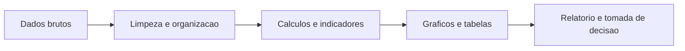

# Curso de Introducao a Linguagem R

## Modulo 1 - Primeiros passos com R 

**Publico-alvo:** estudantes e profissionais que desejam iniciar no R para organizar, analisar e comunicar dados.

**Proposta do modulo:** apresentar a linguagem R, instalar e reconhecer o ambiente de trabalho, executar os primeiros comandos, criar objetos, fazer calculos simples, entender tipos basicos de dados e identificar erros comuns do inicio do aprendizado.


---

## 1. Boas-vindas

Ola! Seja bem-vindo(a) ao primeiro modulo do curso de **Introducao ao Software R aplicado**.

Neste modulo, vamos construir uma base segura para que a turma consiga:

- entender por que aprender R pode melhorar o trabalho com dados;
- instalar o R e o RStudio;
- reconhecer a interface do RStudio;
- executar comandos no console;
- criar scripts;
- atribuir valores a objetos;
- realizar calculos simples;
- reconhecer tipos de objetos;
- instalar pacotes;
- consultar ajuda;
- identificar erros comuns.

Ao final do modulo, o estudante deve conseguir abrir o RStudio, escrever comandos simples, salvar um script, criar objetos, fazer operacoes matematicas e interpretar mensagens basicas de erro.

---

## 2. Por que aprender R?

O R e uma linguagem de programacao e um ambiente de software voltado para **analise estatistica, manipulacao de dados, visualizacao e automacao de tarefas**.

Na Vigilancia em Saude, o R pode ajudar em atividades como:

- calcular indicadores epidemiologicos;
- organizar bancos de dados;
- limpar e padronizar variaveis;
- produzir tabelas e graficos;
- construir relatorios reprodutiveis;
- reduzir tarefas repetitivas;
- apoiar a tomada de decisao;
- documentar o caminho usado em uma analise.

Uma vantagem importante e que o R e **gratuito, aberto e extensivel**. Isso significa que a turma pode instalar, estudar e usar sem depender de licencas pagas.

### 2.1 R como ferramenta de trabalho

Em muitos fluxos de trabalho, planilhas sao uteis para consulta e pequenas organizacoes. Mas, quando os dados crescem ou quando a mesma analise precisa ser repetida varias vezes, o R se torna muito forte.

Imagine que uma equipe precise calcular a taxa de mortalidade, atualizar graficos e gerar um relatorio toda semana. Em vez de refazer tudo manualmente, o R permite registrar cada passo em um script. Quando novos dados chegam, basta executar o script novamente.



---

## 3. Objetivos do Modulo

O objetivo deste modulo e proporcionar uma introducao abrangente a linguagem R e ao uso do RStudio como ambiente de trabalho.

Os principais objetivos sao:

1. **Instalar o R e o RStudio**
   - preparar o computador para executar comandos e scripts em R;
   - diferenciar o R, que e a linguagem/ambiente de execucao, do RStudio, que e uma interface de trabalho.

2. **Instalar pacotes e compreender seu uso**
   - entender o que sao pacotes;
   - aprender a instalar e carregar pacotes;
   - perceber que pacotes ampliam as capacidades do R.

3. **Compreender o fluxo de trabalho**
   - criar, editar, executar e salvar scripts;
   - organizar arquivos de projeto;
   - reproduzir uma analise do inicio ao fim.

4. **Reconhecer a estrutura da linguagem R**
   - usar operadores;
   - criar objetos;
   - chamar funcoes;
   - reconhecer tipos basicos de objetos.

5. **Identificar erros e avisos comuns**
   - diferenciar erro de aviso;
   - observar mensagens do console;
   - corrigir problemas simples de digitacao e tipo de dado.

6. **Consultar ajuda e comunidade**
   - usar a ajuda interna do R;
   - buscar documentacao;
   - consultar comunidades e materiais confiaveis.

---

## 4. Conteudo Programatico

**Modulo 1: Introducao a linguagem R**

- Instalacao do R e RStudio
- Familiarizacao com a interface
- Instalacao de pacotes
- Fluxo de trabalho com R
- Estrutura da linguagem R e termos-chave
- Atribuicao de variaveis
- Exibicao de objetos
- Operacoes matematicas simples
- Tipos de objetos aceitos no R
- Demonstracoes graficas
- Primeiros calculos aplicados a Vigilancia em Saude
- Erros comuns no inicio do aprendizado
- Ajuda, documentacao e comunidade

---

## 5. Instalacao do R e do RStudio

Para trabalhar com R, precisamos entender dois elementos:

- **R:** a linguagem e o ambiente que executa os comandos.
- **RStudio:** uma interface grafica, tambem chamada de IDE, que facilita escrever scripts, ver objetos, consultar arquivos, gerar graficos e organizar projetos.

### 5.1 Instalando o R

1. Acesse o site oficial do CRAN: [https://cran.r-project.org/](https://cran.r-project.org/)
2. Escolha o sistema operacional: Windows, macOS ou Linux.
3. Baixe e instale a versao recomendada.
4. Ao final, o computador ja conseguira executar comandos em R.

### 5.2 Instalando o RStudio

1. Acesse a pagina oficial do RStudio Desktop: [https://posit.co/download/rstudio-desktop/](https://posit.co/download/rstudio-desktop/)
2. Baixe a versao adequada para seu sistema operacional.
3. Instale normalmente.
4. Abra o RStudio.

### 5.3 Conferindo se esta tudo funcionando

No RStudio, localize o **Console** e digite:

```r
1 + 1
```

Se o R responder:

```r
[1] 2
```

entao o ambiente esta funcionando.

---

## 6. Familiarizacao com o RStudio

O RStudio costuma ser organizado em paineis. A disposicao pode variar, mas geralmente encontramos:

| Area | Para que serve |
|---|---|
| Console | Executar comandos imediatamente |
| Script/Source | Escrever e salvar codigo |
| Environment | Ver objetos criados na sessao |
| Files | Navegar pelos arquivos |
| Plots | Visualizar graficos |
| Packages | Ver pacotes instalados |
| Help | Consultar ajuda |
| Viewer | Exibir paginas, relatorios e apps |

### 6.1 Console x Script

O **Console** e bom para testar comandos rapidos.

O **Script** e melhor para registrar uma analise, salvar o passo a passo e repetir depois.

Exemplo:

```r
# Este comando pode ser testado no console
5 + 3

# Mas, em uma analise real, o ideal e salvar em um script
soma <- 5 + 3
print(soma)
```

### 6.2 Sugestao de organizacao

Para cada modulo ou exercicio, crie uma pasta. Dentro dela, use nomes claros:

```text
curso-r/
  modulo-1/
    scripts/
      script01_primeiros_comandos.R
    dados/
    resultados/
```

Essa organizacao evita que arquivos fiquem espalhados e ajuda a reproduzir as analises.

---

## 7. Termos-chave da linguagem R

Antes dos primeiros codigos, precisamos conhecer alguns termos.

| Termo | Explicacao curta | Exemplo |
|---|---|---|
| Objeto | Nome que guarda um valor | `x <- 10` |
| Atribuicao | Ato de guardar um valor em um objeto | `<-` |
| Funcao | Comando que executa uma tarefa | `print(x)` |
| Argumento | Informacao passada para uma funcao | `digits = 2` |
| Vetor | Conjunto de valores do mesmo tipo basico | `c(1, 5, 3)` |
| Pacote | Conjunto de funcoes e dados extras | `ggplot2` |
| Comentario | Texto ignorado pelo R | `# isto e comentario` |

### 7.1 Comentarios

No R, tudo que vem depois de `#` em uma linha e interpretado como comentario.

```r
# Isto e um comentario
# Comentarios ajudam a explicar o raciocinio do codigo
idade <- 30
```

Use comentarios para explicar **por que** algo esta sendo feito, nao apenas para repetir o que o codigo ja mostra.

---

## 8. Primeiro contato: R como calculadora

O R pode ser usado como uma calculadora.

```r
5 * 5
25 + 75
9 / 3
3^2
sqrt(81)
```

### 8.1 Operadores matematicos

| Operador | Significado | Exemplo | Resultado |
|---|---|---:|---:|
| `+` | Soma | `5 + 3` | `8` |
| `-` | Subtracao | `10 - 2` | `8` |
| `*` | Multiplicacao | `4 * 6` | `24` |
| `/` | Divisao | `15 / 3` | `5` |
| `^` ou `**` | Potencia | `5^3` | `125` |
| `sqrt()` | Raiz quadrada | `sqrt(81)` | `9` |

> Dica didatica: mostre para a turma que `3^2` significa 3 elevado a 2, e que `sqrt(81)` e uma funcao. A funcao recebe um valor entre parenteses e devolve uma resposta.

---

## 9. Atribuicao de variaveis

Em R, usamos o operador `<-` para atribuir valores a objetos.

```r
x <- 10
y <- "Ola, mundo!"
```

Leia assim:

- `x <- 10`: o objeto `x` recebe o valor `10`;
- `y <- "Ola, mundo!"`: o objeto `y` recebe um texto.

Tambem existe o operador `=`, mas no inicio do curso e recomendavel padronizar o uso de `<-`, porque essa e uma convencao muito comum na comunidade R.

### 9.1 Visualizando objetos

Para exibir o valor de um objeto, podemos usar `print()`:

```r
print(x)
```

Ou simplesmente digitar o nome do objeto:

```r
y
```

No RStudio, os objetos criados tambem aparecem no painel **Environment**.

---

## 10. Script 01 comentado

Abaixo esta uma versao revisada e comentada do primeiro script.

```r
### 1. Atribuicao de variaveis

x <- 10
y <- "Ola, mundo!"

### 2. Exibicao de variaveis

print(x)
y

### 3. Operacoes matematicas simples

soma <- 5 + 3
subtracao <- 10 - 2
multiplicacao <- 4 * 6
divisao <- 15 / 3
exponencial <- 5^3

print(soma)
print(subtracao)
print(multiplicacao)
print(divisao)
print(exponencial)

### 4. Demonstracoes graficas

demo(graphics)
demo(image)
demo(persp)

### 5. Tipos de objetos aceitos no ambiente R

x <- c(1, 5, 3, 8)
y <- c("A", "B", "A", "B", "C")
e <- 2 > 4
z <- 1i

mode(x)
mode(y)
mode(e)
mode(z)
```

### 10.1 O que este script ensina?

Este script apresenta cinco ideias essenciais:

- criar objetos;
- exibir objetos;
- calcular;
- executar demonstracoes graficas;
- reconhecer tipos de objetos.

---

## 11. Tipos basicos de objetos no R

O R trabalha com diferentes tipos de dados. No inicio, os mais importantes sao:

| Tipo | Descricao | Exemplo |
|---|---|---|
| Numeric | Numeros reais | `10`, `3.14`, `5/2` |
| Character | Texto | `"A"`, `"Ola"` |
| Logical | Verdadeiro ou falso | `TRUE`, `FALSE`, `2 > 4` |
| Complex | Numeros complexos | `1i` |

### 11.1 Criando vetores

A funcao `c()` combina valores em um vetor.

```r
x <- c(1, 5, 3, 8)
y <- c("A", "B", "A", "B", "C")
e <- 2 > 4
z <- 1i
```

### 11.2 Verificando o tipo com `mode()`

```r
mode(x)
mode(y)
mode(e)
mode(z)
```

Resultados esperados:

```r
mode(x) # "numeric"
mode(y) # "character"
mode(e) # "logical"
mode(z) # "complex"
```

### 11.3 Explicando o exemplo `2 > 4`

O comando:

```r
e <- 2 > 4
```

pergunta ao R: "2 e maior que 4?"

Como isso e falso, o objeto `e` guarda:

```r
FALSE
```

---

## 12. Demonstracoes graficas

O R possui muitas possibilidades para construir graficos, mapas e outros recursos visuais.

Para mostrar isso de forma rapida, podemos usar demonstracoes internas:

```r
demo(graphics)
demo(image)
demo(persp)
```

Durante a aula, execute um comando por vez e va clicando quando o R pedir interacao.

### 12.1 Para que servem essas demonstracoes?

| Demonstracao | Ideia principal |
|---|---|
| `demo(graphics)` | Mostra graficos basicos do R |
| `demo(image)` | Mostra representacoes em imagem/matriz |
| `demo(persp)` | Mostra graficos em perspectiva 3D |

> Observacao: neste primeiro modulo, o objetivo nao e dominar graficos, mas despertar a percepcao de que o R e uma ferramenta visual poderosa.

---

## 13. Primeiros calculos aplicados: taxa de mortalidade por Covid-19

Agora vamos usar o R para um exemplo aplicado a Vigilancia em Saude.

Queremos calcular uma taxa de mortalidade por 100.000 habitantes.

Formula:

```text
taxa = (numero de obitos / populacao) * 100000
```

### 13.1 Calculo direto

```r
63452 / 203062512
```

Esse resultado mostra a proporcao de mortes em relacao a populacao.

Para transformar em taxa por 100.000 habitantes:

```r
(63452 / 203062512) * 100000
```

### 13.2 Usando objetos

Guardar valores em objetos deixa o codigo mais claro.

```r
mortes_covid19 <- 63452
populacao_brasil <- 203062512
taxa_mortalidade <- (mortes_covid19 / populacao_brasil) * 100000
taxa_mortalidade
```

Agora o codigo fica mais facil de ler:

- `mortes_covid19` guarda o numero de mortes;
- `populacao_brasil` guarda a populacao;
- `taxa_mortalidade` guarda o resultado do calculo.

### 13.3 Arredondando o resultado

A funcao `round()` arredonda numeros.

```r
taxa_mortalidade <- round(
  (63452 / 203062512) * 100000,
  digits = 2
)

taxa_mortalidade
```

O argumento `digits = 2` indica que queremos duas casas decimais.

### 13.4 Melhorando a legibilidade do codigo

Uma boa pratica e quebrar calculos maiores em etapas.

```r
mortes_covid19 <- 63452
populacao_brasil <- 203062512
constante <- 100000

taxa_mortalidade <- (mortes_covid19 / populacao_brasil) * constante
taxa_mortalidade_arredondada <- round(taxa_mortalidade, digits = 2)

taxa_mortalidade_arredondada
```

Essa versao e um pouco mais longa, mas e melhor para ensinar, revisar e explicar.

---

## 14. Erros comuns no inicio do aprendizado

Errar faz parte do aprendizado. No R, as mensagens de erro costumam indicar onde esta o problema.

### 14.1 R diferencia maiusculas e minusculas

O R e **case-sensitive**. Isso significa que letras maiusculas e minusculas fazem diferenca.

```r
taxa_mortalidade <- 31.25

TAXA_MORTALIDADE
```

Esse comando gera erro porque `taxa_mortalidade` e diferente de `TAXA_MORTALIDADE`.

Possivel mensagem:

```r
Error: object 'TAXA_MORTALIDADE' not found
```

Como corrigir:

```r
taxa_mortalidade
```

### 14.2 Tentar calcular com texto

```r
sqrt("10")
```

Esse comando gera erro porque `"10"` esta entre aspas. Para o R, isso e texto, nao numero.

Correto:

```r
sqrt(10)
```

### 14.3 Esquecer parenteses em funcoes

Incorreto:

```r
sqrt 81
```

Correto:

```r
sqrt(81)
```

### 14.4 Esquecer aspas em textos

Incorreto:

```r
nome <- Vigilancia
```

Correto:

```r
nome <- "Vigilancia"
```

Sem aspas, o R entende que `Vigilancia` deveria ser um objeto ja existente.

### 14.5 Usar virgula decimal

Em R, o separador decimal padrao e ponto, nao virgula.

Incorreto:

```r
valor <- 3,14
```

Correto:

```r
valor <- 3.14
```

---

## 15. Instalacao e uso de pacotes

O R ja vem com muitas funcoes, mas boa parte de sua forca esta nos pacotes.

Um **pacote** e um conjunto de funcoes, dados e documentacao que amplia o que o R consegue fazer.

### 15.1 Instalando um pacote

Para instalar um pacote, usamos:

```r
install.packages("nome_do_pacote")
```

Exemplo:

```r
install.packages("ggplot2")
```

### 15.2 Carregando um pacote

Depois de instalar, carregamos com:

```r
library(ggplot2)
```

Instalar e carregar sao coisas diferentes:

| Acao | Funcao | Quando fazer |
|---|---|---|
| Instalar | `install.packages()` | Geralmente uma vez |
| Carregar | `library()` | Toda vez que abrir uma nova sessao e quiser usar o pacote |

### 15.3 Pacotes uteis para os proximos modulos

| Pacote | Uso |
|---|---|
| `readr` | Importar arquivos de texto e CSV |
| `dplyr` | Manipular dados |
| `ggplot2` | Criar graficos |
| `tidyr` | Organizar dados em formato adequado |
| `lubridate` | Trabalhar com datas |
| `janitor` | Limpar nomes de colunas e tabelas |
| `sf` | Trabalhar com dados espaciais |

> Sugestao de melhoria para o curso: incluir, ao final do modulo, uma aula curta chamada "meu primeiro pacote", usando `install.packages("janitor")` e `library(janitor)`, pois ele e util para limpeza de bases reais.

---

## 16. Ajuda no R e consulta a comunidade

Aprender R tambem e aprender a procurar ajuda.

### 16.1 Ajuda interna

Para abrir a documentacao de uma funcao:

```r
?round
?sqrt
?mean
```

Outra forma:

```r
help(round)
```

Para procurar por um termo:

```r
help.search("regression")
```

### 16.2 Recursos recomendados

- R Project/CRAN: [https://cran.r-project.org/](https://cran.r-project.org/)
- Manual oficial "An Introduction to R": [https://cran.r-project.org/doc/manuals/r-release/R-intro.html](https://cran.r-project.org/doc/manuals/r-release/R-intro.html)
- RStudio Desktop/User Guide: [https://docs.posit.co/ide/user/](https://docs.posit.co/ide/user/)
- Cheatsheets da Posit: [https://posit.co/resources/cheatsheets/](https://posit.co/resources/cheatsheets/)
- R for Data Science: [https://r4ds.hadley.nz/](https://r4ds.hadley.nz/)
- The Epidemiologist R Handbook: [https://epirhandbook.com/](https://epirhandbook.com/)
- Stack Overflow em portugues: [https://pt.stackoverflow.com/questions/tagged/r](https://pt.stackoverflow.com/questions/tagged/r)
- Comunidade R-Ladies Global: [https://rladies.org/](https://rladies.org/)

---

## 17. Roteiro de aula sugerido

### Aula 1 - Motivacao e instalacao

Tempo sugerido: 40 a 60 minutos.

1. Apresentar o curso e os objetivos do modulo.
2. Explicar por que R e util para Vigilancia em Saude.
3. Instalar R e RStudio.
4. Abrir o RStudio e testar `1 + 1`.
5. Mostrar os paineis principais da interface.

### Aula 2 - Primeiros comandos

Tempo sugerido: 60 a 90 minutos.

1. Usar R como calculadora.
2. Criar objetos com `<-`.
3. Exibir objetos com `print()` e pelo nome.
4. Explicar comentarios com `#`.
5. Rodar o script01.

### Aula 3 - Objetos, tipos e erros comuns

Tempo sugerido: 60 a 90 minutos.

1. Criar vetores com `c()`.
2. Usar `mode()`.
3. Calcular taxa de mortalidade.
4. Arredondar com `round()`.
5. Provocar erros intencionais e corrigir em grupo.

---

## 18. Atividades praticas

### Atividade 1 - R como calculadora

Execute os comandos:

```r
10 + 5
20 - 4
6 * 7
100 / 4
2^5
sqrt(144)
```

Perguntas:

- Qual comando calcula uma potencia?
- Qual comando calcula raiz quadrada?
- O que muda quando usamos parenteses?

### Atividade 2 - Criando objetos

Crie objetos para guardar:

- seu nome;
- sua idade;
- o nome do seu municipio;
- um valor logico que indique se voce ja usou R antes.

Exemplo:

```r
nome <- "Ana"
idade <- 34
municipio <- "Brasilia"
ja_usou_r <- FALSE
```

Depois, use `mode()` para verificar o tipo de cada objeto.

### Atividade 3 - Indicador de saude

Calcule uma taxa por 100.000 habitantes usando os seguintes valores:

```r
obitos <- 250
populacao <- 850000
```

Use a formula:

```r
taxa <- (obitos / populacao) * 100000
```

Depois arredonde o resultado com duas casas decimais.

### Atividade 4 - Corrigindo erros

Os codigos abaixo contem erros. Corrija cada um.

```r
Nome <- "Carlos"
nome
```

```r
sqrt("81")
```

```r
municipio <- Brasilia
```

```r
taxa mortalidade <- 10
```

Dica: nomes de objetos nao devem conter espacos. Use `taxa_mortalidade`.

---

## 19. Checklist do estudante

Ao final deste modulo, verifique se voce consegue:

- abrir o RStudio;
- identificar o console;
- criar e salvar um script;
- executar comandos simples;
- usar `#` para comentarios;
- criar objetos com `<-`;
- exibir objetos;
- usar operadores matematicos;
- criar vetores com `c()`;
- verificar tipos com `mode()`;
- instalar e carregar pacotes;
- usar `?funcao` para consultar ajuda;
- interpretar erros simples.

---

## 20. Script final do modulo

Este script pode ser entregue aos estudantes como arquivo `.R`.

```r
############################################################
# Curso de Introducao ao R
# Modulo 1 - Primeiros comandos
############################################################

# 1. R como calculadora

5 * 5
25 + 75
9 / 3
3^2
sqrt(81)

# 2. Criando objetos

a <- 5 * 5
b <- 25 + 75
c <- 9 / 3
d <- 3^2
e <- sqrt(81)

a
b
c
d
e

# 3. Atribuicao de variaveis

x <- 10
y <- "Ola, mundo!"

print(x)
y

# 4. Operacoes matematicas simples

soma <- 5 + 3
subtracao <- 10 - 2
multiplicacao <- 4 * 6
divisao <- 15 / 3
exponencial <- 5^3

print(soma)
print(subtracao)
print(multiplicacao)
print(divisao)
print(exponencial)

# 5. Tipos de objetos

numeros <- c(1, 5, 3, 8)
categorias <- c("A", "B", "A", "B", "C")
logico <- 2 > 4
complexo <- 1i

mode(numeros)
mode(categorias)
mode(logico)
mode(complexo)

# 6. Calculo da taxa de mortalidade por Covid-19 no Brasil

mortes_covid19 <- 63452
populacao_brasil <- 203062512
constante <- 100000

taxa_mortalidade <- (mortes_covid19 / populacao_brasil) * constante
taxa_mortalidade

taxa_mortalidade_arredondada <- round(taxa_mortalidade, digits = 2)
taxa_mortalidade_arredondada

# 7. Erros comuns para observar

# O R diferencia maiusculas e minusculas:
# TAXA_MORTALIDADE

# Texto nao e numero:
# sqrt("10")

# 8. Demonstracoes graficas

demo(graphics)
demo(image)
demo(persp)
```

---

## 21. Sugestoes de melhoria para os proximos modulos

Para deixar o curso mais aplicado e progressivo, recomendo incluir nos proximos modulos:

1. **Projeto guiado desde o inicio**
   - Criar uma pasta de projeto no RStudio.
   - Salvar scripts, dados e resultados em subpastas.

2. **Base de dados pequena e realista**
   - Usar uma planilha ficticia de notificacoes.
   - Trabalhar com variaveis como municipio, data, sexo, idade, classificacao e evolucao.

3. **Padrao de nomenclatura**
   - Usar nomes em minusculas e com sublinhado: `taxa_mortalidade`, `populacao_brasil`.

4. **Mini-relatorio ao final de cada modulo**
   - Cada estudante entrega um pequeno script comentado.
   - Isso cria habito de reproducibilidade desde o inicio.

5. **Glossario acumulativo**
   - A cada modulo, acrescentar novos termos.
   - Exemplo: objeto, funcao, vetor, pacote, data frame, filtro, agrupamento.

---

## 22. Glossario do Modulo 1

| Termo | Significado |
|---|---|
| R | Linguagem e ambiente para analise estatistica, dados e graficos |
| RStudio | Interface que facilita trabalhar com R |
| Console | Local para executar comandos imediatamente |
| Script | Arquivo onde salvamos codigo |
| Objeto | Nome que guarda um valor |
| Atribuicao | Ato de guardar valor em um objeto |
| Funcao | Comando que executa uma tarefa |
| Argumento | Valor passado para uma funcao |
| Pacote | Extensao com funcoes e recursos adicionais |
| Vetor | Sequencia de valores |
| Numeric | Tipo de dado numerico |
| Character | Tipo de dado textual |
| Logical | Tipo verdadeiro/falso |
| Error | Mensagem indicando que o comando nao foi executado |
| Warning | Aviso de que algo merece atencao, mesmo que o comando possa ter rodado |

---

## 23. Referencias e links

- CRAN - The Comprehensive R Archive Network: [https://cran.r-project.org/](https://cran.r-project.org/)
- Manual oficial "An Introduction to R": [https://cran.r-project.org/doc/manuals/r-release/R-intro.html](https://cran.r-project.org/doc/manuals/r-release/R-intro.html)
- RStudio IDE User Guide: [https://docs.posit.co/ide/user/](https://docs.posit.co/ide/user/)
- Download do RStudio Desktop: [https://posit.co/download/rstudio-desktop/](https://posit.co/download/rstudio-desktop/)
- Cheatsheets da Posit: [https://posit.co/resources/cheatsheets/](https://posit.co/resources/cheatsheets/)
- R for Data Science: [https://r4ds.hadley.nz/](https://r4ds.hadley.nz/)
- The Epidemiologist R Handbook: [https://epirhandbook.com/](https://epirhandbook.com/)

