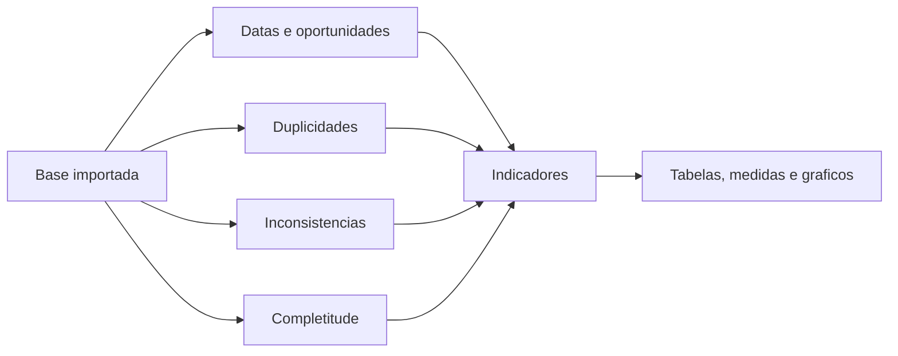

# Curso de Introducao a Linguagem R

## Modulo 4 - Linguagem R aplicada a Vigilancia em Saude

**Publico-alvo:** estudantes e profissionais que ja conhecem comandos basicos, importacao e manipulacao de dados em R, e agora querem aplicar esses conhecimentos em analises comuns da Vigilancia em Saude.

**Proposta do modulo:** consolidar o curso por meio de exemplos praticos: operacoes com datas, calculo de oportunidade, identificacao de duplicidades, analise de inconsistencias, completitude e estatistica descritiva com medidas resumo, tabelas e graficos basicos.

---

## 1. Boas-vindas

Ola! Seja bem-vindo(a) ao quarto modulo do curso de **Introducao ao Software R aplicado a Vigilancia em Saude**.

Chegamos ao ultimo modulo do curso. Neste ponto, espera-se que voce ja tenha:

- instalado R e RStudio;
- criado objetos;
- importado bases de dados;
- entendido tipos de variaveis;
- manipulado bases com `dplyr`;
- limpado e recodificado variaveis;
- unido tabelas;
- exportado resultados.

Agora vamos aplicar esses conhecimentos a tarefas muito presentes na rotina da Vigilancia em Saude:

- trabalhar com datas;
- calcular oportunidades de notificacao, digitacao e encerramento;
- identificar registros duplicados;
- criar bases sem duplicidades;
- avaliar inconsistencias;
- avaliar completitude;
- produzir estatisticas descritivas;
- criar graficos basicos para comunicar resultados.

---

## 2. Por que este modulo importa?

A Vigilancia em Saude depende de informacao qualificada e oportuna. Nao basta ter uma base de dados; e preciso saber se ela esta completa, coerente, livre de duplicidades importantes e pronta para gerar indicadores.

Neste modulo, trabalharemos tres grandes perguntas:

1. **Os eventos foram registrados em tempo oportuno?**
   - Quanto tempo passou entre sintomas e notificacao?
   - Quanto tempo passou entre notificacao e digitacao?
   - Quanto tempo passou entre notificacao e encerramento?

2. **A base tem qualidade suficiente para analise?**
   - Existem duplicidades?
   - Ha inconsistencias?
   - Variaveis importantes estao preenchidas?

3. **Como resumir e comunicar os dados?**
   - Quais sao as frequencias?
   - Quais sao as medidas resumo?
   - Que graficos ajudam a interpretar os dados?



---

## 3. Objetivos do Modulo

Ao final do Modulo 4, os participantes deverao ser capazes de:

1. **Trabalhar com datas no R**
   - reconhecer variaveis de data;
   - converter textos em datas;
   - usar funcoes do pacote `lubridate`;
   - calcular diferencas entre datas.

2. **Calcular oportunidade em sistemas de vigilancia**
   - oportunidade de notificacao;
   - oportunidade de digitacao;
   - oportunidade de encerramento;
   - classificacao de registros oportunos e inoportunos.

3. **Identificar duplicidades**
   - buscar duplicidades com diferentes chaves;
   - usar `janitor::get_dupes()`;
   - criar base sem duplicidades com `distinct()`.

4. **Avaliar qualidade dos dados**
   - identificar inconsistencias;
   - avaliar completitude;
   - diferenciar campo vazio, ignorado e preenchido;
   - criar variaveis de avaliacao.

5. **Aplicar estatistica descritiva**
   - tabelas de frequencia;
   - proporcoes por linha e por coluna;
   - media, mediana, quartis, variancia, desvio padrao e IQR;
   - graficos de barras, setores, boxplot, histograma, evolucao temporal e dispersao.

---

## 4. Conteudo Programatico

**Modulo 4: Linguagem R aplicada a Vigilancia em Saude**

- Operacoes com datas
- Pacote `lubridate`
- Oportunidade de notificacao, digitacao e encerramento
- Resumos por agravo
- Avaliacao de encerramento oportuno
- Identificacao de duplicidades
- Criacao de base sem duplicidades
- Analise de inconsistencias
- Analise de completitude
- Estatistica descritiva para variaveis qualitativas
- Estatistica descritiva para variaveis quantitativas
- Tabelas de contingencia e proporcoes
- Medidas resumo
- Graficos basicos
- Analise temporal de casos de AIDS
- Erros e avisos comuns

---

## 5. Bases usadas no modulo

### 5.1 NINDINET_MODULO4.xlsx

A base `NINDINET_MODULO4.xlsx` esta dentro do arquivo compactado `Nindinet Modulo 4-20260610.zip`.

Ela possui:

- 1000 registros;
- 20 colunas;
- aba chamada `NINDINET`;
- variaveis como `NU_NOTIFIC`, `ID_AGRAVO`, `DT_NOTIFIC`, `DT_SIN_PRI`, `NM_PACIENT`, `DT_NASC`, `NU_IDADE_N`, `CS_SEXO`, `CS_RACA`, `CS_ESCOL_N`, `NM_MAE_PAC`, `DT_INVEST`, `DT_ENCERRA` e `DT_DIGITA`.

Esta base sera usada para:

- operacoes com datas;
- calculo de oportunidade;
- busca de duplicidades;
- avaliacao de inconsistencias;
- avaliacao de completitude.

### 5.2 dados-aids-mod04.csv

A base `dados-aids-mod04.csv` esta dentro do arquivo compactado `Dados Aids-20260610.zip`.

Ela possui:

- 27 linhas, uma para cada UF;
- 14 colunas;
- variaveis `UF_Res`, `Regiao`, `casos2010` a `casos2020` e `casosTotal`.

Esta base sera usada para:

- estatistica descritiva;
- medidas resumo;
- boxplot;
- evolucao temporal;
- analise de casos de AIDS por UF e ano.

---

## 6. Pacotes usados no Modulo 4

```r
install.packages("rio")
install.packages("tidyverse")
install.packages("lubridate")
install.packages("janitor")
```

Carregando:

```r
library(rio)
library(tidyverse)
library(lubridate)
library(janitor)
```

| Pacote | Uso no modulo |
|---|---|
| `rio` | Importar bases em diferentes formatos |
| `tidyverse` | Manipular, resumir e visualizar dados |
| `lubridate` | Trabalhar com datas |
| `janitor` | Limpar dados e identificar duplicidades |
| `dplyr` | Filtrar, criar variaveis, agrupar e resumir |
| `ggplot2` | Criar graficos, quando desejado |

---

## 7. Importando e inspecionando a base NINDINET

```r
library(rio)
library(tidyverse)
library(lubridate)
library(janitor)

setwd("F:/PROJETO_CURSO_R/Modulo 4")

nindinet <- import("DADOS/NINDINET_MODULO4.xlsx")
```

Depois de importar, inspecione:

```r
glimpse(nindinet)
```

Para olhar apenas variaveis que comecam com `DT_`:

```r
nindinet |>
  select(starts_with("DT_")) |>
  glimpse()
```

Essa etapa e essencial porque o calculo de oportunidade depende de datas corretamente interpretadas.

---

## 8. Um pouco sobre datas no R

Datas podem estar em varios formatos:

- `2019-01-22`;
- `22/01/2019`;
- `11062019`;
- texto;
- data e hora.

O pacote `lubridate` facilita a conversao.

### 8.1 Data atual

```r
lubridate::today()
lubridate::today() - 1
lubridate::today() + hours(72)
```

### 8.2 Texto nao e data

```r
hoje <- "03/04/2024"
hoje
class(hoje)
```

O resultado de `class(hoje)` sera `character`, ou seja, texto.

### 8.3 Convertendo texto para data

```r
hoje <- dmy("03/04/2024")
class(hoje)
hoje
```

`dmy()` significa:

- `d`: dia;
- `m`: mes;
- `y`: ano.

Outras funcoes comuns:

| Funcao | Formato esperado | Exemplo |
|---|---|---|
| `dmy()` | dia-mes-ano | `"03/04/2024"` |
| `ymd()` | ano-mes-dia | `"2024-04-03"` |
| `mdy()` | mes-dia-ano | `"04/03/2024"` |

---

## 9. Periodos, duracoes e diferencas entre datas

O R consegue subtrair datas.

```r
nindinet$DT_NOTIFIC - nindinet$DT_SIN_PRI
```

Mas o resultado pode vir como um objeto de duracao. Para calculos de media, mediana e classificacao, e comum transformar em numero.

### 9.1 Exemplos com lubridate

```r
tail(lubridate::as.period(nindinet$DT_NOTIFIC - nindinet$DT_SIN_PRI))
tail(lubridate::as.duration(nindinet$DT_NOTIFIC - nindinet$DT_SIN_PRI))
tail(lubridate::as.difftime(nindinet$DT_NOTIFIC - nindinet$DT_SIN_PRI))
```

Para este modulo, usaremos `as.numeric()` para transformar a diferenca em numero de dias.

---

## 10. Ajustando formatos de datas

No material, as variaveis de data centrais sao:

- `DT_NOTIFIC`;
- `DT_SIN_PRI`;
- `DT_NASC`;
- `DT_INVEST`;
- `DT_ENCERRA`;
- `DT_DIGITA`.

Exemplo de conversao:

```r
nindinet <- nindinet |>
  mutate(
    DT_NOTIFIC = ymd(DT_NOTIFIC),
    DT_SIN_PRI = ymd(DT_SIN_PRI),
    DT_INVEST  = ymd(DT_INVEST),
    DT_ENCERRA = ymd(DT_ENCERRA),
    DT_DIGITA  = dmy(DT_DIGITA)
  )
```

Observe que `DT_DIGITA` usa `dmy()`. No exemplo do material, essa variavel aparece como `11062019`, que representa `11/06/2019`.

Depois, confira:

```r
nindinet |>
  select(starts_with("DT_")) |>
  glimpse()
```

---

## 11. Analise de oportunidade

A oportunidade e um atributo importante para avaliar a velocidade do sistema de Vigilancia Epidemiologica.

Ela reflete a rapidez com que as etapas do sistema sao cumpridas.

### 11.1 Definicoes usadas no modulo

| Indicador | Definicao |
|---|---|
| Oportunidade de notificacao | Intervalo entre `DT_SIN_PRI` e `DT_NOTIFIC` |
| Oportunidade de digitacao | Intervalo entre `DT_NOTIFIC` e `DT_DIGITA` |
| Oportunidade de encerramento | Intervalo entre `DT_NOTIFIC` e `DT_ENCERRA` |

### 11.2 Criando variaveis de oportunidade

Primeiro, veja o problema da subtracao simples:

```r
nindinet <- nindinet |>
  mutate(oportunidade_notificacao = DT_NOTIFIC - DT_SIN_PRI)

glimpse(nindinet$oportunidade_notificacao)
```

Agora, crie variaveis numericas:

```r
nindinet <- nindinet |>
  mutate(
    oportunidade_notificacao  = as.numeric(DT_NOTIFIC - DT_SIN_PRI),
    oportunidade_digitacao    = as.numeric(DT_DIGITA - DT_NOTIFIC),
    oportunidade_encerramento = as.numeric(DT_ENCERRA - DT_NOTIFIC)
  )
```

Inspecione:

```r
nindinet |>
  select(starts_with("oportunidade")) |>
  glimpse()
```

### 11.3 Medidas resumo das oportunidades

```r
mean(nindinet$oportunidade_notificacao)
median(nindinet$oportunidade_notificacao)
```

Para evitar problemas com valores ausentes:

```r
mean(nindinet$oportunidade_notificacao, na.rm = TRUE)
median(nindinet$oportunidade_notificacao, na.rm = TRUE)
```

### 11.4 Resumo por agravo

```r
resumo_oportunidade_digitacao <- nindinet |>
  group_by(ID_AGRAVO) |>
  summarise(
    media_digita = mean(oportunidade_digitacao, na.rm = TRUE),
    mediana_digita = median(oportunidade_digitacao, na.rm = TRUE)
  )

resumo_oportunidade_digitacao
```

---

## 12. Avaliando encerramento oportuno

No exemplo do modulo, consideramos oportuno o encerramento em ate 60 dias.

```r
nindinet <- nindinet |>
  mutate(
    avaliacao_encerramento = if_else(
      oportunidade_encerramento <= 60,
      "Oportuno",
      "Inoportuno"
    )
  )
```

Resumo por agravo e avaliacao:

```r
resumo_encerramento <- nindinet |>
  group_by(ID_AGRAVO, avaliacao_encerramento) |>
  summarise(notificacoes = n())

resumo_encerramento
```

### 12.1 Melhorando com percentual

```r
resumo_encerramento <- nindinet |>
  group_by(ID_AGRAVO, avaliacao_encerramento) |>
  summarise(notificacoes = n(), .groups = "drop_last") |>
  mutate(percentual = notificacoes / sum(notificacoes) * 100)
```

---

## 13. Analise de duplicidades

Duplicidade ocorre quando um mesmo evento, envolvendo o mesmo individuo, foi notificado mais de uma vez.

Em bases grandes, procurar duplicidades manualmente e lento. No R, podemos definir chaves de comparacao e deixar o codigo fazer a busca.

### 13.1 Usando `janitor::get_dupes()`

Cinco chaves:

```r
duplicidades5 <- nindinet |>
  get_dupes(NM_PACIENT, DT_NASC, NM_MAE_PAC, ID_AGRAVO, DT_SIN_PRI)
```

Quatro chaves:

```r
duplicidades4 <- nindinet |>
  get_dupes(NM_PACIENT, DT_NASC, NM_MAE_PAC, ID_AGRAVO)
```

Tres chaves:

```r
duplicidades3 <- nindinet |>
  get_dupes(NM_PACIENT, DT_NASC, NM_MAE_PAC)
```

Outras combinacoes:

```r
duplicidades_agravo <- nindinet |>
  get_dupes(ID_AGRAVO, DT_NOTIFIC, DT_NASC)

duplicidades2 <- nindinet |>
  get_dupes(NM_PACIENT, DT_NASC)
```

### 13.2 Como escolher as chaves?

Chaves mais restritivas reduzem falsos positivos, mas podem deixar passar duplicidades.

Chaves mais amplas encontram mais suspeitas, mas exigem revisao.

| Chave | Uso |
|---|---|
| Nome + data nascimento | Busca ampla |
| Nome + data nascimento + mae | Busca mais especifica |
| Nome + nascimento + mae + agravo | Boa para investigar mesmo agravo |
| Nome + nascimento + mae + agravo + sintomas | Mais restritiva |

> Em bases reais, duplicidade deve ser revisada tecnicamente. O R ajuda a encontrar suspeitas, mas a decisao final depende do contexto e das regras do sistema.

---

## 14. Criando base sem duplicidades

Para manter apenas combinacoes unicas:

```r
sem_duplicidades <- nindinet |>
  distinct(NM_PACIENT, DT_NASC)
```

Com todas as variaveis da base:

```r
sem_duplicidades2 <- nindinet |>
  distinct(NM_PACIENT, DT_NASC, .keep_all = TRUE)
```

`distinct()` remove duplicidades considerando as colunas informadas.

` .keep_all = TRUE` preserva as demais colunas.

---

## 15. Analise de inconsistencias

Inconsistencia e uma contradicao entre variaveis relacionadas.

Exemplo do modulo: a variavel `CS_ESCOL_N` deve ser preenchida automaticamente como `10 - nao se aplica` quando a idade e menor que 7 anos. Para casos com idade maior, alguns preenchimentos podem ser incoerentes.

### 15.1 Buscando categorias por idade

```r
nrow(nindinet)

nindinet |>
  filter(NU_IDADE_N >= 4007, NU_IDADE_N <= 4009) |>
  group_by(CS_ESCOL_N) |>
  summarise(casos = n())
```

### 15.2 Filtrando registros suspeitos

```r
nindinet |>
  filter(NU_IDADE_N >= 4007, NU_IDADE_N <= 4009) |>
  filter(CS_ESCOL_N == "05" | CS_ESCOL_N == "06" | CS_ESCOL_N == "07") |>
  select(NU_NOTIFIC, NM_PACIENT, DT_NASC, NU_IDADE_N, CS_ESCOL_N)
```

### 15.3 Criando variavel de inconsistencia

```r
nindinet <- nindinet |>
  mutate(
    inc_escolaridade = case_when(
      NU_IDADE_N >= 4007 & NU_IDADE_N <= 4009 & CS_ESCOL_N == "05" ~ "Inconsistencia",
      NU_IDADE_N >= 4007 & NU_IDADE_N <= 4009 & CS_ESCOL_N == "06" ~ "Inconsistencia",
      NU_IDADE_N >= 4007 & NU_IDADE_N <= 4009 & CS_ESCOL_N == "07" ~ "Inconsistencia",
      NU_IDADE_N >= 4007 & NU_IDADE_N <= 4009 & CS_ESCOL_N == "08" ~ "Inconsistencia",
      CS_ESCOL_N == "09" ~ "Ignorado",
      is.na(CS_ESCOL_N) ~ "Ignorado",
      TRUE ~ "Consistente"
    )
  )
```

Resumo:

```r
nindinet |>
  group_by(inc_escolaridade) |>
  summarise(notificacoes = n())
```

---

## 16. Analise de completitude

Completitude avalia o preenchimento de variaveis.

Uma variavel pode estar:

- preenchida;
- vazia (`NA`);
- preenchida como ignorado;
- preenchida com codigo invalido.

### 16.1 Avaliando apenas registros vazios

Exemplo com `CS_RACA`:

```r
nindinet |>
  summarise(
    completo = sum(!is.na(CS_RACA)),
    total_notificacoes = n(),
    missing = sum(is.na(CS_RACA)),
    taxa_completitude = (completo / total_notificacoes) * 100
  )
```

### 16.2 Avaliando categorias

```r
nindinet |>
  group_by(CS_RACA) |>
  summarise(notificacoes = n())
```

### 16.3 Considerando `9 - Ignorado` como incompleto

```r
nindinet |>
  summarise(
    completo = sum(!is.na(CS_RACA) & CS_RACA != "9"),
    total_notificacoes = n(),
    missing = sum(is.na(CS_RACA) | CS_RACA == "9"),
    taxa_completitude = (completo / total_notificacoes) * 100
  )
```

### 16.4 Outro exemplo: ocupacao

```r
nindinet |>
  summarise(
    completo = sum(!is.na(ID_OCUPA_N) & ID_OCUPA_N != "9"),
    total_notificacoes = n(),
    missing = sum(is.na(ID_OCUPA_N) | ID_OCUPA_N == "9"),
    taxa_completitude = (completo / total_notificacoes) * 100
  )
```

> Dica: sempre leia o dicionario de dados. Em alguns sistemas, o codigo de ignorado pode variar conforme a variavel.

---

## 17. Estatistica descritiva

Estatistica descritiva e o conjunto de tecnicas usado para organizar, resumir e interpretar dados.

Ela ajuda a responder:

- quantos casos existem?
- quais categorias sao mais frequentes?
- qual e a media?
- qual e a mediana?
- como os dados se distribuem?
- ha valores extremos?
- existe tendencia temporal?

---

## 18. Variaveis qualitativas

Variaveis qualitativas representam categorias.

Exemplos:

- sexo;
- raca/cor;
- regiao;
- agravo;
- classificacao final;
- fumante: sim/nao.

### 18.1 Tabela de contingencia

```r
dados <- data.frame(
  sexo = c("M", "F", "M", "F", "M"),
  grupo = c("A", "B", "B", "A", "B")
)

tab_cont <- table(dados$sexo, dados$grupo)
tab_cont
```

### 18.2 Proporcoes por linha

```r
prop_por_linha <- prop.table(tab_cont, margin = 1)
prop_por_linha
```

Use quando deseja saber a distribuicao dentro de cada linha.

### 18.3 Proporcoes por coluna

```r
prop_por_coluna <- prop.table(tab_cont, margin = 2)
prop_por_coluna
```

Use quando deseja saber a distribuicao dentro de cada coluna.

### 18.4 Exemplo com fumantes

```r
set.seed(325)

dados <- data.frame(
  fumante = sample(c("Sim", "Nao"), 1000, replace = TRUE),
  faixa_etaria = sample(c("0-18", "19-35", "36-50", "51-65", "65+"), 1000, replace = TRUE),
  regiao = sample(c("Norte", "Sul", "Sudeste", "Nordeste", "Centro-oeste"), 1000, replace = TRUE)
)

str(dados)
head(dados)
```

Fumantes por faixa etaria:

```r
tabela_faixa_etaria <- table(dados$faixa_etaria, dados$fumante)
tabela_faixa_etaria

percentual_por_faixa_etaria <- prop.table(tabela_faixa_etaria, margin = 1) * 100
percentual_por_faixa_etaria
```

Fumantes por regiao:

```r
tabela_regiao <- table(dados$regiao, dados$fumante)
tabela_regiao

percentual_por_regiao <- prop.table(tabela_regiao, margin = 1) * 100
percentual_por_regiao
```

---

## 19. Variaveis quantitativas

Variaveis quantitativas representam numeros.

Exemplos:

- idade;
- tempo ate notificacao;
- numero de casos;
- taxa de incidencia;
- peso;
- altura;
- colesterol.

### 19.1 Medidas resumo

```r
dados <- c(10, 15, 20, 25, 30, 35, 40, 45, 50)

media <- mean(dados)
mediana <- median(dados)
quartis <- quantile(dados, probs = c(0.25, 0.5, 0.75))
variancia <- var(dados)
desvio_padrao <- sd(dados)
intervalo_interquartil <- IQR(dados)
```

### 19.2 O que cada medida significa?

| Medida | Interpretacao |
|---|---|
| Media | Soma dos valores dividida pela quantidade |
| Mediana | Valor central quando os dados estao ordenados |
| Q1 | Primeiro quartil: 25% dos dados ficam abaixo |
| Q3 | Terceiro quartil: 75% dos dados ficam abaixo |
| Variancia | Medida de dispersao em torno da media |
| Desvio padrao | Dispersao na mesma unidade dos dados |
| IQR | Intervalo interquartil, isto e, Q3 - Q1 |

### 19.3 Resumo com dplyr

```r
library(dplyr)

dados_df <- data.frame(dados)

dados_df |>
  summarise(
    media = mean(dados),
    mediana = median(dados),
    variancia = var(dados),
    desvio_padrao = sd(dados),
    Q1 = quantile(dados, 0.25),
    Q3 = quantile(dados, 0.75),
    IQR = IQR(dados)
  )
```

---

## 20. Exemplo aplicado: dados de AIDS

Importando:

```r
setwd("F:/PROJETO_CURSO_R/Modulo 4")

aids <- read.csv2("DADOS/dados-aids-mod04.csv")
```

Inspecionando:

```r
View(aids)
head(aids)
str(aids)
```

### 20.1 Medidas resumo de casos totais

```r
mean(aids$casosTotal)
median(aids$casosTotal)
quantile(aids$casosTotal, probs = c(0.25, 0.5, 0.75))
var(aids$casosTotal)
sd(aids$casosTotal)
IQR(aids$casosTotal)
```

### 20.2 Resumo com `summarise()`

```r
aids |>
  summarise(
    media = mean(casosTotal),
    mediana = median(casosTotal),
    variancia = var(casosTotal),
    desvio_padrao = sd(casosTotal),
    Q1 = quantile(casosTotal, 0.25),
    Q3 = quantile(casosTotal, 0.75),
    IQR = IQR(casosTotal)
  )
```

### 20.3 Resumo por regiao

```r
aids |>
  group_by(Regiao) |>
  summarise(
    ufs = n(),
    total_casos = sum(casosTotal),
    media_casos = mean(casosTotal),
    mediana_casos = median(casosTotal)
  )
```

> Observacao: se a coluna estiver com acento, como `Região`, use o nome entre crases: `` `Região` ``.

---

## 21. Graficos basicos

### 21.1 Grafico de setores

Exemplo: distribuicao de tipos de cancer.

```r
tipos_cancer <- c("Cancer de pulmao", "Cancer de mama", "Cancer de prostata", "Outros")
casos <- c(200, 300, 250, 150)
dados <- data.frame(Tipo = tipos_cancer, Casos = casos)

pie(dados$Casos, labels = dados$Tipo, main = "Distribuicao de tipos de cancer")
pie(dados$Casos, labels = dados$Tipo, main = "Distribuicao de tipos de cancer", col = c(1, 2, 3, 4))
```

### 21.2 Grafico de barras

```r
faixa_etaria <- c("0-5 anos", "6-12 anos", "13-18 anos", "19-50 anos", "51+ anos")
taxa_vacinacao <- c(90, 95, 85, 75, 65)
dados <- data.frame(Faixa_etaria = faixa_etaria, Taxa_vacinacao = taxa_vacinacao)

barplot(
  dados$Taxa_vacinacao,
  names.arg = dados$Faixa_etaria,
  main = "Taxa de vacinacao por faixa etaria",
  xlab = "Faixa Etaria",
  ylab = "Taxa de Vacinacao (%)",
  col = "skyblue",
  ylim = c(0, 100)
)
```

### 21.3 Boxplot

```r
idades <- c(35, 42, 48, 50, 55, 60, 65, 70, 72, 80, 85)
dados <- data.frame(Idades = idades)

boxplot(
  dados$Idades,
  main = "Distribuicao de idades de pacientes com diabetes",
  ylab = "Idade",
  col = "gray"
)
```

Aplicado a AIDS:

```r
boxplot(aids$casosTotal)
```

### 21.4 Histograma

```r
colesterol <- c(150, 165, 170, 180, 185, 190, 200, 210, 220, 240, 250, 270)
dados <- data.frame(Colesterol = colesterol)

hist(
  dados$Colesterol,
  main = "Distribuicao dos niveis de colesterol",
  xlab = "Nivel de colesterol",
  ylab = "Frequencia",
  col = "gray"
)
```

### 21.5 Evolucao temporal

```r
anos <- c(2010, 2011, 2012, 2013, 2014, 2015, 2016)
casos_doenca <- c(100, 120, 130, 150, 160, 180, 200)
dados <- data.frame(Ano = anos, Casos_doenca = casos_doenca)

plot(
  dados$Ano,
  dados$Casos_doenca,
  type = "o",
  col = "red",
  xlab = "Ano",
  ylab = "Casos de doenca",
  main = "Evolucao temporal da doenca",
  las = 1
)
```

### 21.6 Evolucao temporal da AIDS em Sao Paulo

```r
aids_SP <- subset(
  aids,
  select = c(
    casos2010, casos2011, casos2012, casos2013, casos2014,
    casos2015, casos2016, casos2017, casos2018, casos2019, casos2020
  ),
  aids$UF_Res == "Sao Paulo"
)

anos <- c(2010, 2011, 2012, 2013, 2014, 2015, 2016, 2017, 2018, 2019, 2020)

plot(
  anos,
  aids_SP,
  type = "o",
  lwd = 3,
  col = "blue",
  xlab = "Ano",
  ylab = "Casos de AIDS",
  main = "Evolucao temporal da AIDS - SP"
)
```

### 21.7 Grafico de dispersao

```r
imc <- c(22, 24, 26, 28, 30, 32, 34, 36, 38, 40)
risco_cardiaco <- c(10, 15, 20, 25, 30, 35, 40, 45, 50, 55)
dados <- data.frame(IMC = imc, Risco_cardiaco = risco_cardiaco)

plot(
  dados$IMC,
  dados$Risco_cardiaco,
  col = "blue",
  xlab = "Indice de Massa Corporal (IMC)",
  ylab = "Risco de doencas cardiacas",
  main = "Relacao entre IMC e risco cardiaco"
)
```

---

## 22. Erros e avisos comuns

### 22.1 Data importada como texto

Problema:

```r
class(nindinet$DT_DIGITA)
```

Se o resultado for `character`, converta:

```r
nindinet <- nindinet |>
  mutate(DT_DIGITA = dmy(DT_DIGITA))
```

### 22.2 Formato de data errado

Se voce usar `ymd()` em uma data que esta em formato dia-mes-ano, o resultado pode virar `NA`.

Compare:

```r
ymd("03/04/2024")
dmy("03/04/2024")
```

### 22.3 Media com valores ausentes

Problema:

```r
mean(nindinet$oportunidade_notificacao)
```

Se houver `NA`, o resultado pode ser `NA`.

Solucao:

```r
mean(nindinet$oportunidade_notificacao, na.rm = TRUE)
```

### 22.4 Variavel numerica importada como texto

Problema:

```r
mean(aids$casosTotal)
```

Se `casosTotal` estiver como texto, converta:

```r
aids <- aids |>
  mutate(casosTotal = as.numeric(casosTotal))
```

### 22.5 Nome de coluna com acento

Se a coluna se chama `Região`, use crases:

```r
aids |>
  group_by(`Região`) |>
  summarise(total = sum(casosTotal))
```

Outra opcao e limpar nomes:

```r
aids <- janitor::clean_names(aids)
```

### 22.6 Duplicidade nao significa exclusao automatica

`get_dupes()` aponta suspeitas. Antes de excluir registros, revise as regras do sistema e o contexto epidemiologico.

---

## 23. Roteiro de aula sugerido

### Aula 1 - Datas e oportunidade

Tempo sugerido: 90 minutos.

1. Importar `NINDINET_MODULO4.xlsx`.
2. Inspecionar variaveis de data.
3. Explicar `dmy()`, `ymd()` e `class()`.
4. Converter datas.
5. Calcular oportunidades.
6. Criar resumo por agravo.
7. Classificar encerramento como oportuno ou inoportuno.

### Aula 2 - Duplicidades e qualidade da base

Tempo sugerido: 90 minutos.

1. Explicar conceito de duplicidade.
2. Testar chaves com `get_dupes()`.
3. Criar base sem duplicidades com `distinct()`.
4. Discutir falsos positivos.
5. Avaliar inconsistencia entre idade e escolaridade.
6. Criar variavel `inc_escolaridade`.

### Aula 3 - Completitude

Tempo sugerido: 60 minutos.

1. Explicar completitude.
2. Avaliar `CS_RACA`.
3. Diferenciar `NA` e ignorado.
4. Avaliar `ID_OCUPA_N`.
5. Construir tabela de completitude por variavel.

### Aula 4 - Estatistica descritiva

Tempo sugerido: 90 minutos.

1. Variaveis qualitativas e quantitativas.
2. Tabelas de frequencia.
3. Proporcoes por linha e coluna.
4. Media, mediana, quartis, variancia, desvio padrao e IQR.
5. Aplicacao na base de AIDS.

### Aula 5 - Graficos e fechamento

Tempo sugerido: 90 minutos.

1. Grafico de barras.
2. Grafico de setores.
3. Boxplot.
4. Histograma.
5. Evolucao temporal.
6. Discussao final: o que automatizar na rotina da Vigilancia?

---

## 24. Atividades praticas

### Atividade 1 - Datas

Converta as datas da base NINDINET e responda:

- qual e o tipo de `DT_NOTIFIC` antes da conversao?
- qual e o tipo depois?
- quantos registros tem `DT_DIGITA` ausente?

### Atividade 2 - Oportunidade

Crie as tres variaveis:

- `oportunidade_notificacao`;
- `oportunidade_digitacao`;
- `oportunidade_encerramento`.

Depois calcule media e mediana por `ID_AGRAVO`.

### Atividade 3 - Encerramento oportuno

Classifique o encerramento em:

- `Oportuno`, se ate 60 dias;
- `Inoportuno`, se acima de 60 dias.

Depois gere tabela por agravo.

### Atividade 4 - Duplicidades

Use `get_dupes()` com:

- duas chaves;
- tres chaves;
- cinco chaves.

Compare o numero de registros suspeitos em cada resultado.

### Atividade 5 - Completitude

Calcule completitude para:

- `CS_RACA`;
- `CS_ESCOL_N`;
- `ID_OCUPA_N`.

Considere tanto `NA` quanto `9` como incompletos quando fizer sentido pelo dicionario.

### Atividade 6 - AIDS

Importe `dados-aids-mod04.csv` e calcule para `casosTotal`:

- media;
- mediana;
- Q1;
- Q3;
- IQR;
- desvio padrao.

Depois faca um boxplot.

### Atividade 7 - Grafico temporal

Escolha uma UF e crie um grafico de evolucao temporal dos casos entre 2010 e 2020.

---

## 25. Scripts revisados do modulo

### 25.1 Script: datas, oportunidade e qualidade

```r
############################################################
# Curso de Introducao ao R aplicado a Vigilancia em Saude
# Modulo 4 - Datas, oportunidade, duplicidade e completitude
############################################################

library(rio)
library(tidyverse)
library(lubridate)
library(janitor)

setwd("F:/PROJETO_CURSO_R/Modulo 4")

nindinet <- import("DADOS/NINDINET_MODULO4.xlsx")

glimpse(nindinet)

nindinet |>
  select(starts_with("DT_")) |>
  glimpse()

nindinet <- nindinet |>
  mutate(
    DT_NOTIFIC = ymd(DT_NOTIFIC),
    DT_SIN_PRI = ymd(DT_SIN_PRI),
    DT_INVEST  = ymd(DT_INVEST),
    DT_ENCERRA = ymd(DT_ENCERRA),
    DT_DIGITA  = dmy(DT_DIGITA)
  )

nindinet <- nindinet |>
  mutate(
    oportunidade_notificacao  = as.numeric(DT_NOTIFIC - DT_SIN_PRI),
    oportunidade_digitacao    = as.numeric(DT_DIGITA - DT_NOTIFIC),
    oportunidade_encerramento = as.numeric(DT_ENCERRA - DT_NOTIFIC)
  )

resumo_oportunidade_digitacao <- nindinet |>
  group_by(ID_AGRAVO) |>
  summarise(
    media_digita = mean(oportunidade_digitacao, na.rm = TRUE),
    mediana_digita = median(oportunidade_digitacao, na.rm = TRUE)
  )

nindinet <- nindinet |>
  mutate(
    avaliacao_encerramento = if_else(
      oportunidade_encerramento <= 60,
      "Oportuno",
      "Inoportuno"
    )
  )

resumo_encerramento <- nindinet |>
  group_by(ID_AGRAVO, avaliacao_encerramento) |>
  summarise(notificacoes = n(), .groups = "drop")

duplicidades5 <- nindinet |>
  get_dupes(NM_PACIENT, DT_NASC, NM_MAE_PAC, ID_AGRAVO, DT_SIN_PRI)

duplicidades3 <- nindinet |>
  get_dupes(NM_PACIENT, DT_NASC, NM_MAE_PAC)

sem_duplicidades <- nindinet |>
  distinct(NM_PACIENT, DT_NASC, .keep_all = TRUE)

nindinet <- nindinet |>
  mutate(
    inc_escolaridade = case_when(
      NU_IDADE_N >= 4007 & NU_IDADE_N <= 4009 & CS_ESCOL_N == "05" ~ "Inconsistencia",
      NU_IDADE_N >= 4007 & NU_IDADE_N <= 4009 & CS_ESCOL_N == "06" ~ "Inconsistencia",
      NU_IDADE_N >= 4007 & NU_IDADE_N <= 4009 & CS_ESCOL_N == "07" ~ "Inconsistencia",
      NU_IDADE_N >= 4007 & NU_IDADE_N <= 4009 & CS_ESCOL_N == "08" ~ "Inconsistencia",
      CS_ESCOL_N == "09" ~ "Ignorado",
      is.na(CS_ESCOL_N) ~ "Ignorado",
      TRUE ~ "Consistente"
    )
  )

nindinet |>
  summarise(
    completo = sum(!is.na(CS_RACA) & CS_RACA != "9"),
    total_notificacoes = n(),
    missing = sum(is.na(CS_RACA) | CS_RACA == "9"),
    taxa_completitude = (completo / total_notificacoes) * 100
  )
```

### 25.2 Script: estatistica descritiva

```r
############################################################
# Modulo 4 - Estatistica descritiva
############################################################

library(dplyr)

dados <- data.frame(
  sexo = c("M", "F", "M", "F", "M"),
  grupo = c("A", "B", "B", "A", "B")
)

tab_cont <- table(dados$sexo, dados$grupo)
prop.table(tab_cont, margin = 1)
prop.table(tab_cont, margin = 2)

valores <- c(10, 15, 20, 25, 30, 35, 40, 45, 50)

data.frame(valores) |>
  summarise(
    media = mean(valores),
    mediana = median(valores),
    variancia = var(valores),
    desvio_padrao = sd(valores),
    Q1 = quantile(valores, 0.25),
    Q3 = quantile(valores, 0.75),
    IQR = IQR(valores)
  )
```

### 25.3 Script: AIDS e graficos

```r
############################################################
# Modulo 4 - AIDS, medidas resumo e graficos
############################################################

library(dplyr)

setwd("F:/PROJETO_CURSO_R/Modulo 4")

aids <- read.csv2("DADOS/dados-aids-mod04.csv")

head(aids)
str(aids)

aids |>
  summarise(
    media = mean(casosTotal),
    mediana = median(casosTotal),
    variancia = var(casosTotal),
    desvio_padrao = sd(casosTotal),
    Q1 = quantile(casosTotal, 0.25),
    Q3 = quantile(casosTotal, 0.75),
    IQR = IQR(casosTotal)
  )

boxplot(aids$casosTotal)

aids_SP <- subset(
  aids,
  select = c(
    casos2010, casos2011, casos2012, casos2013, casos2014,
    casos2015, casos2016, casos2017, casos2018, casos2019, casos2020
  ),
  aids$UF_Res == "Sao Paulo"
)

anos <- 2010:2020

plot(
  anos,
  aids_SP,
  type = "o",
  lwd = 3,
  col = "blue",
  xlab = "Ano",
  ylab = "Casos de AIDS",
  main = "Evolucao temporal da AIDS - SP"
)
```

---

## 26. Script final do modulo

```r
############################################################
# Curso de Introducao ao R aplicado a Vigilancia em Saude
# Modulo 4 - Aplicacoes em Vigilancia em Saude
############################################################

install.packages("rio")
install.packages("tidyverse")
install.packages("lubridate")
install.packages("janitor")

library(rio)
library(tidyverse)
library(lubridate)
library(janitor)

setwd("F:/PROJETO_CURSO_R/Modulo 4")

# 1. Base NINDINET --------------------------------------------------------

nindinet <- import("DADOS/NINDINET_MODULO4.xlsx")

glimpse(nindinet)

nindinet <- nindinet |>
  mutate(
    DT_NOTIFIC = ymd(DT_NOTIFIC),
    DT_SIN_PRI = ymd(DT_SIN_PRI),
    DT_INVEST  = ymd(DT_INVEST),
    DT_ENCERRA = ymd(DT_ENCERRA),
    DT_DIGITA  = dmy(DT_DIGITA)
  )

nindinet <- nindinet |>
  mutate(
    oportunidade_notificacao  = as.numeric(DT_NOTIFIC - DT_SIN_PRI),
    oportunidade_digitacao    = as.numeric(DT_DIGITA - DT_NOTIFIC),
    oportunidade_encerramento = as.numeric(DT_ENCERRA - DT_NOTIFIC),
    avaliacao_encerramento = if_else(
      oportunidade_encerramento <= 60,
      "Oportuno",
      "Inoportuno"
    )
  )

resumo_oportunidade <- nindinet |>
  group_by(ID_AGRAVO) |>
  summarise(
    media_notificacao = mean(oportunidade_notificacao, na.rm = TRUE),
    mediana_notificacao = median(oportunidade_notificacao, na.rm = TRUE),
    media_digitacao = mean(oportunidade_digitacao, na.rm = TRUE),
    mediana_digitacao = median(oportunidade_digitacao, na.rm = TRUE),
    media_encerramento = mean(oportunidade_encerramento, na.rm = TRUE),
    mediana_encerramento = median(oportunidade_encerramento, na.rm = TRUE)
  )

resumo_encerramento <- nindinet |>
  group_by(ID_AGRAVO, avaliacao_encerramento) |>
  summarise(notificacoes = n(), .groups = "drop")

duplicidades5 <- nindinet |>
  get_dupes(NM_PACIENT, DT_NASC, NM_MAE_PAC, ID_AGRAVO, DT_SIN_PRI)

completitude_raca <- nindinet |>
  summarise(
    completo = sum(!is.na(CS_RACA) & CS_RACA != "9"),
    total_notificacoes = n(),
    missing = sum(is.na(CS_RACA) | CS_RACA == "9"),
    taxa_completitude = (completo / total_notificacoes) * 100
  )

# 2. Base AIDS ------------------------------------------------------------

aids <- read.csv2("DADOS/dados-aids-mod04.csv")

resumo_aids <- aids |>
  summarise(
    media = mean(casosTotal),
    mediana = median(casosTotal),
    variancia = var(casosTotal),
    desvio_padrao = sd(casosTotal),
    Q1 = quantile(casosTotal, 0.25),
    Q3 = quantile(casosTotal, 0.75),
    IQR = IQR(casosTotal)
  )

boxplot(
  aids$casosTotal,
  main = "Distribuicao dos casos totais de AIDS por UF",
  ylab = "Casos totais"
)
```

---

## 27. Sugestoes de melhoria para o curso

1. **Criar uma ficha de qualidade da base**
   - Total de registros, duplicidades suspeitas, completitude por variavel e inconsistencias encontradas.

2. **Gerar um relatorio final automatizado**
   - Em modulo futuro, usar Quarto para produzir HTML/PDF com tabelas e graficos.

3. **Adicionar interpretacao dos indicadores**
   - Nao apenas calcular oportunidade, mas discutir impacto para a resposta da vigilancia.

4. **Substituir `attach()` por referencia direta**
   - Preferir `aids$casosTotal` ou fluxos com `dplyr`.

5. **Padronizar nomes de colunas**
   - Usar `janitor::clean_names()` quando bases tiverem acentos ou espacos.

6. **Exportar produtos finais**
   - Resumos de oportunidade, duplicidades e completitude em CSV/XLSX.

---

## 28. Checklist do estudante

Ao final deste modulo, verifique se voce consegue:

- importar a base NINDINET;
- identificar variaveis de data;
- converter datas com `lubridate`;
- calcular diferenca entre datas;
- criar variaveis de oportunidade;
- calcular media e mediana com `na.rm = TRUE`;
- classificar encerramento oportuno;
- identificar duplicidades com `get_dupes()`;
- criar base sem duplicidades com `distinct()`;
- avaliar inconsistencias entre variaveis;
- calcular completitude;
- importar base de AIDS;
- calcular medidas resumo;
- construir tabela de contingencia;
- calcular proporcoes por linha e coluna;
- criar grafico de barras, setores, boxplot, histograma e serie temporal.

---

## 29. Glossario do Modulo 4

| Termo | Significado |
|---|---|
| Oportunidade | Tempo entre etapas do sistema de vigilancia |
| Oportunidade de notificacao | Tempo entre sintomas e notificacao |
| Oportunidade de digitacao | Tempo entre notificacao e digitacao |
| Oportunidade de encerramento | Tempo entre notificacao e encerramento |
| Duplicidade | Registro repetido ou possivelmente repetido |
| Chave de identificacao | Conjunto de variaveis usado para comparar registros |
| Inconsistencia | Contradicao entre variaveis relacionadas |
| Completitude | Grau de preenchimento de uma variavel |
| Ignorado | Valor preenchido como desconhecido ou nao informado |
| Estatistica descritiva | Organizacao, resumo e interpretacao de dados |
| Tabela de contingencia | Cruzamento entre variaveis categoricas |
| Media | Soma dos valores dividida pela quantidade |
| Mediana | Valor central dos dados ordenados |
| Quartil | Divisao dos dados em quatro partes |
| Desvio padrao | Medida de dispersao |
| IQR | Intervalo interquartil |
| Boxplot | Grafico para ver distribuicao e valores extremos |
| Histograma | Grafico da distribuicao de variavel numerica |

---

## 30. Referencias e links

- CRAN - The Comprehensive R Archive Network: [https://cran.r-project.org/](https://cran.r-project.org/)
- Tidyverse: [https://www.tidyverse.org/](https://www.tidyverse.org/)
- Documentacao do `dplyr`: [https://dplyr.tidyverse.org/reference/index.html](https://dplyr.tidyverse.org/reference/index.html)
- Documentacao do `lubridate`: [https://lubridate.tidyverse.org/reference/index.html](https://lubridate.tidyverse.org/reference/index.html)
- Documentacao do `janitor`: [https://sfirke.github.io/janitor/](https://sfirke.github.io/janitor/)
- R for Data Science: [https://r4ds.hadley.nz/](https://r4ds.hadley.nz/)
- The Epidemiologist R Handbook: [https://epirhandbook.com/](https://epirhandbook.com/)
- DATASUS Tabnet: [https://datasus.saude.gov.br/informacoes-de-saude-tabnet/](https://datasus.saude.gov.br/informacoes-de-saude-tabnet/)

